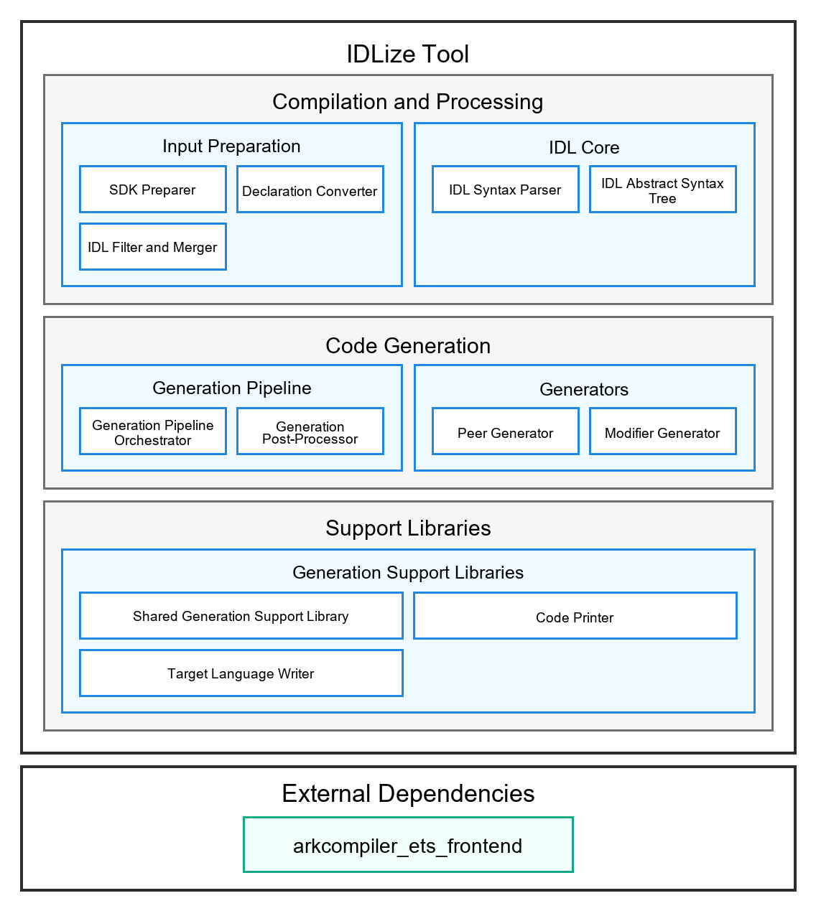

# IDLize Tool

<p></p>

## Introduction

IDLize is a compile-time code generation tool for ArkUI development. It reads
interface declaration files (`.d.ets`, `.idl`) and generates code. Generated
artifacts include ArkTS-layer code, C++-layer code, and serialization code for
callback and type conversion between the ArkTS layer and the C++ layer.

This repository is part of the ArkUI subsystem and provides code generation
tools for ArkUI development. For more ArkUI framework subsystem concepts, see the
[ArkUI framework subsystem README](https://gitcode.com/openharmony/docs/blob/master/zh-cn/readme/ArkUI%E6%A1%86%E6%9E%B6%E5%AD%90%E7%B3%BB%E7%BB%9F.md)
(Chinese).

> **Who this is for.** This README targets **IDLize tool developers** who add
> generator capabilities, maintain generator behavior, or debug generated
> output. If you only want to **use** IDLize to generate ArkUI code, start at
> [Using IDLize as a Tool](#using-idlize-as-a-tool).

### Key Concepts

**FrameNode**
A C++-layer ArkUI component node that represents one component instance in the
ArkUI tree. It stores the state required for properties, layout, and rendering.

**Peer**
An ArkTS-layer class generated by IDLize. It exposes component attributes and
methods, then forwards operations such as attribute settings to the component on
the C++ layer.

**Modifier**
A C++-layer class generated by IDLize. It passes component property changes to a
FrameNode.

**Serializer**
Serialization code generated by IDLize for type conversion between the ArkTS
layer and the C++ layer.

### Architecture

**Figure 1** IDLize architecture



### Architecture Notes

IDLize mainly consists of three module groups: compilation and processing, code
generation, and support libraries.

#### Compilation and Processing Modules

These modules organize external SDKs, supplementary interfaces, and handwritten
interfaces into a unified interface description that generators can consume
consistently.

- Input preparation converts, trims, and merges input interface descriptions so
  later stages only process the required, consistent interface set.
  - The SDK preparer preprocesses the OHOS SDK and extracts the interface
    declaration files required for ArkUI code generation.
  - The declaration converter reads ArkTS-style declaration files and converts
    classes, interfaces, enumerations, attributes, methods, and component
    information into unified interface description files.
  - The IDL filter and merger combines converted interface files with extra
    interface files, selects the parts needed for ArkUI component generation,
    removes unrelated content, and generates module configuration required by
    downstream generators.
- The IDL core understands the unified interface description and turns textual
  interface content into a structured semantic model shared by all generators.
  - The IDL parser reads interface description text, recognizes packages,
    namespaces, interfaces, enumerations, attributes, methods, types, and
    extended information, and reports diagnostics when the format is invalid.
  - The IDL abstract syntax tree stores declarations, type relationships,
    inheritance relationships, and source locations in a tree structure. It is
    the foundation for later filtering, conversion, and generation.

#### Code Generation Modules

These modules convert the unified interface description into ArkTS-layer code,
C++-layer code, serialization logic, and project integration files required by
ArkUI.

- The generation pipeline organizes the full pre-generation and post-generation
  flow so interface descriptions can reliably become generated artifacts in the
  target directory.
  - The generation pipeline orchestrator connects input preparation, interface
    parsing, code generation, and formatting in order.
  - The generation postprocessor handles formatting and output directory
    organization after generation so results can be used directly by downstream
    projects.
- Generators produce code for different components based on component and
  interface relationships. Each generator serves a specific runtime path.
  - The Peer generator creates ArkTS-layer component wrappers, creates the
    corresponding ArkTS-layer nodes, stores handles required for cross-language
    calls, and forwards attribute and method calls to the C++ layer.
  - The Modifier generator creates the property update path, records, merges,
    and applies property changes, exposes C++-callable update entry points, and
    applies property changes to ArkUI nodes.

#### Support Libraries

Support libraries provide reusable capabilities used throughout generation so
generators do not repeatedly implement file layout, indentation, type spelling,
and target-language differences.

- The generation support library assembles generated fragments into complete
  files and handles dependency collection, output paths, namespaces, copyright
  headers, and language wrappers consistently.
  - The shared generation support library provides shared component collection,
    dependency collection, file layout, module import, and serialization helper
    capabilities.
  - Code printers output text hierarchically, maintain indentation, compose
    fragments, and write files so generated code stays structured and stable.
  - Target language writers convert common generation actions such as classes,
    interfaces, methods, attributes, conditions, loops, imports, and type
    conversion into concrete syntax for each target language.

#### External Dependencies

External dependencies provide the low-level ability to read declarations and
understand ArkTS syntax. They allow the declaration conversion stage to
recognize ArkTS interface structures accurately.

- `arkcompiler_ets_frontend` provides ArkTS declaration parsing so the tool can
  read ArkTS interface structures from the SDK and convert them into the unified
  interface description used by downstream generation.

## Directory

The repository root contains these key directories:

```text
/arkui_idlize
├── arkgen                 # ArkUI component generator
├── core                   # Core IDL AST definitions
├── doc                    # Tool-user documentation
├── doc_developer          # Tool-developer documentation
├── etsgen                 # .d.ets to IDL converter
├── idlinter               # .idl syntax checker
├── libohos                # Code generation support library
├── runner                 # Generation pipeline orchestrator
├── scraper                # SDK preprocessing tools
└── tools                  # Repository packaging and release tools
```

## Build and Usage

### Build the Development Environment

**Prerequisites:** Node.js 18 or later and git.

1. Clone submodules and install dependencies.

```bash
git submodule update --init
npm i
cd external
npm i
cd ..
```

2. Compile the pipeline entry point.

```bash
cd runner
npm run compile
cd ..
```

3. Download the OHOS SDK.

```bash
npm run download:sdk
```

The development environment is ready when these commands complete without
errors.

### Run the Standard Generation Flow

Run the standard pipeline from the repository root:

```bash
bash generate.sh
```

Generated output is written to `./out`; intermediate pipeline artifacts are
written under `runner/out`.

### Common Troubleshooting

| Symptom | Check | Fix |
|---|---|---|
| `node` or `npm` reports a version or syntax error | Run `node -v` from the repository root. | Use Node.js 18 or later, then reinstall dependencies if needed. |
| `npm run compile` fails inside `external/` | Re-run `cd external && npm i` first. | `external/` and submodules must be installed before compiling. |
| Generated output misses an expected API | Compare `out/`, `runner/out/peers/`, and `runner/out/idl/`. | Confirm that the SDK declaration is correct, then rerun `bash generate.sh`. |

For deeper debugging, see
[Trace generated output](doc/en/USER_GUIDE.md#3-check-whether-generated-output-is-correct)
and [Debugging path](doc_developer/en/ARCHITECTURE.md#6-debugging-path).

## Description

### Interface Description

IDLize provides command-line tools through npm.

| Tool | npm package | Function |
|---|---|---|
| ArkUI Code Generator | `arkgen` | Generates ArkTS peer, C++ libace modifier, and Arkoala binding code from IDL definitions. |
| IDL Converter | `etsgen` | Converts `.d.ts` and `.d.ets` declarations to IDL format. |
| Generation Pipeline Orchestrator | `runner` | Orchestrates SDK preparation, IDL conversion, scraping, peer generation, and output installation for the standard generation flow. |
| Declaration Checkers | `linter`, `idlinter` | Validate `.d.ts`, `.d.ets`, and `.idl` declarations. |

For command parameters and examples, see the
[Tool User Guide](doc/en/USER_GUIDE.md),
[CLI Reference](doc/en/CLI_REFERENCE.md), and
[IDL Specification](doc/en/IDL_SPEC.md).

### Using IDLize as a Tool

Tool users usually provide SDK declarations or handwritten IDL, run the
pipeline, and use the generated code.

```bash
bash generate.sh
```

## Documentation

### Tool Developer Documentation

| Document | Description |
|---|---|
| [Tool Developer Guide](doc_developer/en/DEVELOPER_GUIDE.md) | Environment setup, development flow, core concepts, and source-code map for tool developers. |
| [Architecture Design](doc_developer/en/ARCHITECTURE.md) | Pipeline architecture and workspace responsibilities. |

### Tool User Documentation

| Document | Description |
|---|---|
| [Tool User Guide](doc/en/USER_GUIDE.md) | IDLize tool-user workflows: initial generation, new APIs, and parameter changes. |
| [CLI Reference](doc/en/CLI_REFERENCE.md) | `runner` options and usage. |
| [IDL Specification](doc/en/IDL_SPEC.md) | IDL syntax, types, and extended attributes. |

## Related Repositories

[ArkUI framework subsystem](https://gitcode.com/openharmony/docs/blob/master/zh-cn/readme/ArkUI%E6%A1%86%E6%9E%B6%E5%AD%90%E7%B3%BB%E7%BB%9F.md)

[arkui_ace_engine](https://gitcode.com/openharmony/arkui_ace_engine)

[arkui_ace_engine_lite](https://gitcode.com/openharmony/arkui_ace_engine_lite)

[arkui_napi](https://gitcode.com/openharmony/arkui_napi)

[**arkui_idlize**](https://gitcode.com/openharmony-sig/arkui_idlize)
