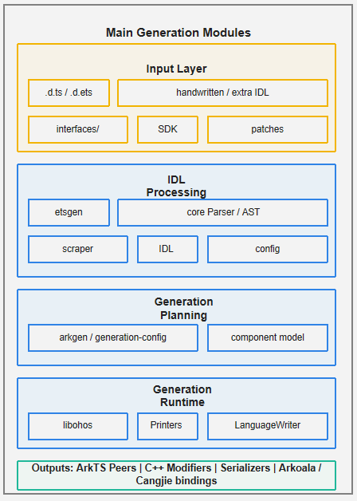

# IDLize Component

<p></p>

[中文文档](README_zh.md)

## Introduction

IDLize is a compiler toolchain for the OpenHarmony ArkUI ecosystem. It
ingests interface declarations (`.d.ts`, `.d.ets`, `.idl`) and generates
native binding code, including ArkTS peer classes, C++ libace modifiers,
and serialization code used by the ArkUI component framework.

This repository is part of the ArkUI framework subsystem. It provides the
IDL conversion, parsing, generation, and pipeline orchestration tools used
to produce ArkUI bridge-layer code for target languages such as ArkTS and
Cangjie.
For more ArkUI framework subsystem concepts, see the
[ArkUI framework subsystem README](https://gitcode.com/openharmony/docs/blob/master/zh-cn/readme/ArkUI%E6%A1%86%E6%9E%B6%E5%AD%90%E7%B3%BB%E7%BB%9F.md).

This repository documentation is mainly for IDLize tool developers who add
generator features, maintain the pipeline, or debug generated output. The
tool users of this repository are ArkUI system developers who run IDLize as
part of the ArkUI binding workflow; they can start from
[Using IDLize as a Tool User](#using-idlize-as-a-tool-user).

### Key Concepts

**Arkoala**
Arkoala is the multi-language ArkUI runtime project that consumes generated
IDLize bindings. In this repository, Arkoala-related output includes peer
interfaces, language bindings, and serialization glue for targets such as
ArkTS and Cangjie.

**framenode**
A native ArkUI tree node that represents one component instance in the
runtime UI tree. It stores the native state used for properties, layout,
and rendering.

**peer**
A generated application-layer class that mirrors an ArkUI component's API
surface. A peer exposes the component's attributes and methods, then
forwards updates for the corresponding framenode to the native side.

**modifier**
A generated C++ libace object that applies property changes to a framenode
at runtime. Modifiers receive serialized setter data and translate it into
native ArkUI calls.

**serializer**
Generated code that encodes property values for inter-process communication
(IPC). Serializers convert typed values from IDL representation into a wire
format suitable for crossing the ArkTS/C++ boundary.

**materialized**
A component whose peer is fully generated from its IDL definition rather
than stubbed out. Materialization is controlled per component in
`arkgen/generation-config/config.json`. Non-materialized components produce
minimal stubs.

### Architecture



Figure 1 IDLize architecture

IDLize uses the following pipeline:

1. `scraper/` pulls and normalizes external SDK content.
2. `etsgen/` converts `.d.ts` and `.d.ets` declarations to `.idl`.
3. `core/` parses IDL files and builds the IDL abstract syntax tree (AST).
4. `arkgen/` and `libohos/` walk the AST and print ArkTS peers, C++ libace
   modifiers, serializers, and Arkoala glue code.
5. `runner/` installs generated output into the target directory.

## Directory

The repository root contains the following key directories:

```text
/arkui_idlize
├── arkgen                 # ArkUI component peer generator and generation config
├── arktscgen              # ArkTS-specific code generation path
├── artwork                # Project artwork used by documentation
├── core                   # IDL AST, parser, LanguageWriter, config, diagnostics
├── doc                    # Tool-user documentation
├── doc_developer          # Tool-developer documentation
├── dtsgen                 # Reverse generator from IDL to .d.ts declarations
├── etsgen                 # .d.ts/.d.ets to IDL transformer
├── external               # Vendored dependencies used by the toolchain
├── idlinter               # IDL lint rules
├── interface_sdk-js       # Vendored upstream SDK submodule, read-only
├── interfaces             # Packaged interface definitions consumed downstream
├── libohos                # Shared printers, serializers, and peer infrastructure
├── linter                 # .d.ts/.d.ets declaration lint rules
├── ohosgen                # OHOS-target generator and integration demos
├── runner                 # End-to-end pipeline orchestrator and m3 command
├── scraper                # SDK scraping, caching, and normalization utilities
├── sdk-patched            # Patched upstream TypeScript SDK declarations
├── sdk-patched-arkts      # Patched upstream ArkTS SDK declarations
└── tools                  # Repository setup, SDK download, and release utilities
```

Generated output directories such as `out/`, `build/`, `bundled/`, and
`lib/` directories adjacent to `src/` are pipeline products and should not
be edited manually.

## Constraints

- Use Node.js 18 or later. The verified CLI environment uses Node.js 18.
- Run commands from the repository root unless a step explicitly changes
  directories.
- Initialize submodules before installing or compiling dependencies.
- Prepare `external/libarkts` with `PANDA_SDK_VERSION=1.5.0-dev.58082`
  before compiling the full pipeline.
- Do not hand-edit `interface_sdk-js/`; patch upstream declarations through
  `sdk-patched/` or `sdk-patched-arkts/`.
- Regenerate output with `bash generate.sh` after any pipeline-affecting
  change.

## Build and Usage

### Build the Development Environment

1. Clone submodules and install root dependencies.

```bash
git submodule update --init
npm i
cd external
npm i
cd ..
```

2. Prepare `libarkts` so ArkTS-related generators can compile.

```bash
cd external/libarkts
PANDA_SDK_VERSION=1.5.0-dev.58082 npm run panda:sdk:reinstall
npm run compile
cd ../..
```

3. Compile the pipeline entry point.

```bash
cd runner
npm run compile
cd ..
```

4. Download and prepare the SDK inputs used by the standard generation
   flow.

```bash
npm run download:sdk
```

The environment is ready when the commands complete without errors.

### Run the Standard Generation Flow

Run the standard pipeline from the repository root:

```bash
bash generate.sh
```

Installed generated output is written to `./out`; intermediate pipeline
artifacts are written under `runner/out`. Treat generated code as
unexpected when it does not match the source declaration or IDL shape, such
as a missing component, method, or attribute; a wrong parameter type,
optional marker, or return type; missing target files; or compile errors in
the generated ArkTS or C++ output.

To find the stage that diverged, work backwards through the artifacts:

1. Check the installed output in `out/` for the visible symptom.
2. Compare the intermediate peer output in `runner/out/peers/sig/` or
   `runner/out/peers/libace/` with the expected API shape.
3. Inspect `runner/out/idl/` to verify what the parser received.
4. If the IDL is already wrong, check earlier staging areas such as
   `runner/out/patched-sdk-arkts/`, `runner/out/patched-sdk-ts/`, and
   `runner/out/scraper/`.

### Common Troubleshooting

| Symptom | Check | Fix |
|---|---|---|
| `node` or `npm` fails with a version or syntax error | Run `node -v` from the repository root. | Use Node.js 18 or later, then reinstall dependencies if needed. |
| Dependency installation fails | Confirm submodules are initialized and install commands run from the expected directory. | Run `git submodule update --init`, then rerun `npm i` in the repository root and `external/`. Check network or proxy settings if npm cannot download packages. |
| `external/libarkts` cannot find the panda SDK | Confirm the command is run from `external/libarkts` and includes the required `PANDA_SDK_VERSION`. | Run `PANDA_SDK_VERSION=1.5.0-dev.58082 npm run panda:sdk:reinstall`, then `npm run compile`. |
| Generated output misses an expected API | Compare `out/`, `runner/out/peers/`, and `runner/out/idl/`. | Ensure the source declaration is in the SDK patch or extra IDL input, then rerun `bash generate.sh`. |

### Develop a Pipeline Change

1. Select the workspace that owns the change.

| Change | Workspace |
|---|---|
| IDL parser, AST, `LanguageWriter` | `core/` |
| `.d.ts` or `.d.ets` to IDL conversion | `etsgen/` |
| ArkUI peer generation and generation config | `arkgen/` |
| Shared printers, serializers, peer infrastructure | `libohos/` |
| End-to-end pipeline orchestration | `runner/` |
| Declaration linting | `linter/`, `idlinter/` |

2. Compile the affected workspace, or compile through `runner` when the
   change spans multiple pipeline stages.

```bash
npm run -C core compile
npm run -C etsgen compile
npm run -C arkgen compile
npm run -C runner compile
```

3. Run the focused tests or checks that match the change.

```bash
npm run -C core test
npm run -C etsgen test
npm run -C arkgen test
npm run sanity
```

4. Regenerate after any pipeline-affecting change.

```bash
bash generate.sh
```

## Description

### Interface Description

IDLize exposes command-line tools through npm workspace packages.

| Tool | Package or workspace | Function |
|---|---|---|
| Peer Generator | `arkgen` | Generates ArkTS peers, C++ libace modifiers, and Arkoala bindings from IDL definitions. |
| IDL Converter | `etsgen` | Converts `.d.ts` and `.d.ets` declarations to IDL format. |
| Pipeline Runner | `runner` | Orchestrates SDK preparation, IDL conversion, scraping, peer generation, and output installation through `m3`. |
| Declaration Linters | `linter`, `idlinter` | Validate `.d.ts`, `.d.ets`, and `.idl` declarations. |
| IDL Generator | `dtsgen` | Generates `.d.ts` declarations from IDL definitions. |

For command parameters and examples, see the
[Tool User Guide](doc/en/USER_GUIDE.md),
[CLI Reference](doc/en/CLI_REFERENCE.md), and
[IDL Specification](doc/en/IDL_SPEC.md).

### Using IDLize as a Tool User

Tool users usually provide SDK declarations or handwritten IDL, run the
pipeline, and consume the generated ArkTS/C++ bindings.

```bash
bash generate.sh
```

For custom runs, use `runner m3` with the SDK stage, target, output path,
and config files you need. See the [Tool User Guide](doc/en/USER_GUIDE.md)
for common workflows.

## Documentation

### Tool Developer Documentation

| Document | Description |
|---|---|
| [Tool Developer Guide](doc_developer/en/DEVELOPER_GUIDE.md) | Starter guide for tool developers: setup, workflow, concepts, and code map. |
| [Architecture](doc_developer/en/ARCHITECTURE.md) | Pipeline architecture and workspace responsibilities. |

### Tool User Documentation

| Document | Description |
|---|---|
| [Tool User Guide](doc/en/USER_GUIDE.md) | IDLize user workflow: initial generation, new interfaces, parameter changes. |
| [CLI Reference](doc/en/CLI_REFERENCE.md) | Parameters and usage for `runner`. |
| [IDL Specification](doc/en/IDL_SPEC.md) | IDL language syntax, types, and extended attributes. |

## Repositories Involved

[ArkUI framework subsystem](https://gitcode.com/openharmony/docs/blob/master/zh-cn/readme/ArkUI%E6%A1%86%E6%9E%B6%E5%AD%90%E7%B3%BB%E7%BB%9F.md)

[arkui_ace_engine](https://gitcode.com/openharmony/arkui_ace_engine)

[arkui_ace_engine_lite](https://gitcode.com/openharmony/arkui_ace_engine_lite)

[arkui_napi](https://gitcode.com/openharmony/arkui_napi)

[**arkui_idlize**](https://gitcode.com/openharmony-sig/arkui_idlize)
