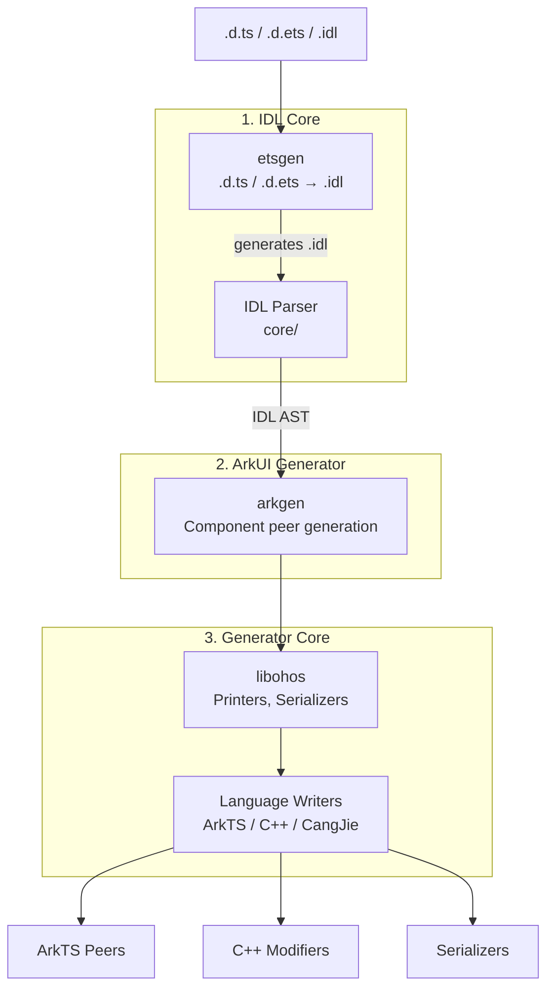

# <p>  IDLize <p/>

[中文文档](README_zh.md)

## What is IDLize

IDLize is a compiler toolchain for the OpenHarmony/ArkUI ecosystem that
ingests interface declarations (`.d.ts`, `.d.ets`, `.idl`) and generates
native bindings. Generated artifacts include ArkTS peer classes, C++
libace modifiers, and serialization code for the ArkUI component
framework.

This repository's public documentation is primarily for IDLize tool
developers: people who add generator features, maintain the pipeline, or
debug generated output. Tool users who only need to run IDLize should start
with [Using IDLize as a Tool User](#using-idlize-as-a-tool-user).

## Tool Developer Setup

**Step 1: Clone and install**

```bash
git submodule update --init
npm i
cd external && npm i && cd ..
```

**Step 2: Prepare libarkts**

```bash
cd external/libarkts
PANDA_SDK_VERSION=1.5.0-dev.58082 npm run panda:sdk:reinstall
npm run compile
cd ../..
```

**Step 3: Compile the pipeline**

```bash
cd runner && npm run compile && cd ..
```

**Step 4: Download and prepare the SDK**

```bash
npm run download:sdk
```

This gives you a local development environment that can compile the
pipeline and run the standard generation flow.

## Development Workflow

1. Pick the workspace that owns the change.

| Change | Workspace |
|---|---|
| IDL parser, AST, `LanguageWriter` | `core/` |
| `.d.ts` / `.d.ets` to IDL conversion | `etsgen/` |
| ArkUI peer generation and generation config | `arkgen/` |
| Shared printers, serializers, peer infrastructure | `libohos/` |
| End-to-end pipeline orchestration | `runner/` |
| Declaration linting | `linter/`, `idlinter/` |

2. Compile the affected workspace, or compile through `runner` when the
   change spans multiple pipeline stages.

```bash
npm run -C core compile
npm run -C etsgen compile
npm run -C arkgen compile
npm run -C runner compile
```

3. Run the focused tests or checks that match the change.

```bash
npm run -C core test
npm run -C etsgen test
npm run -C arkgen test
npm run sanity
```

4. Regenerate after any pipeline-affecting change.

```bash
bash generate.sh
```

Installed generated output is written to `./out`; intermediate pipeline
artifacts are written under `runner/out`. When generated code looks wrong,
work backwards from `out/` to `runner/out/peers/` and then to
`runner/out/idl/` to identify the stage that diverged.

Do not hand-edit generated output directories such as `out/`, `build/`,
`bundled/`, or `lib/` when they sit next to `src/`.

## Architecture



## Key Concepts

**peer**
A generated class that mirrors an ArkUI component's API surface. Each peer
wraps a native framenode and exposes the component's attributes and methods
to the application layer.

**modifier**
A generated C++ object that applies property changes to a framenode at
runtime. Modifiers bridge the ArkTS peer layer and the native ArkUI
rendering engine, translating attribute setters into native calls.

**serializer**
Generated code that encodes property values for IPC calls. Serializers
convert typed values from IDL representation into a wire format suitable
for crossing the ArkTS/C++ boundary.

**framenode**
A native ArkUI tree node that is the runtime target of a modifier. Each
visible component in the UI tree corresponds to a framenode; modifiers and
peers operate on framenodes to update properties, layout, and rendering
state.

**materialized**
A component whose peer is fully generated from its IDL definition rather
than stubbed out. Materialization is controlled per component in
`arkgen/generation-config/config.json`. Non-materialized components produce
minimal stubs.

## Using IDLize as a Tool User

Tool users usually provide SDK declarations or handwritten IDL, run the
pipeline, and consume the generated ArkTS/C++ bindings.

```bash
bash generate.sh
```

For custom runs, use `runner m3` with the SDK stage, target, output path,
and config files you need. See [Tool User Guide](doc/en/USER_GUIDE.md),
[CLI Reference](doc/en/CLI_REFERENCE.md), and
[IDL Specification](doc/en/IDL_SPEC.md).

## Tools

**Peer Generator** (`arkgen`) -- Generates ArkTS peers, C++ libace
modifiers, and Arkoala bindings from IDL definitions. Primary mode:
`--idl2peer`. See [Tool User Guide](doc/en/USER_GUIDE.md).

**IDL Converter** (`etsgen`) -- Converts `.d.ts` and `.d.ets`
declarations to IDL format. Primary mode: `--ets2idl`.

**Pipeline Runner** (`runner`) -- Orchestrates the end-to-end generation
pipeline via the `m3` command, which chains SDK preparation, IDL
conversion, scraping, peer generation, and output installation. See
[CLI Reference](doc/en/CLI_REFERENCE.md).

**Linters** -- The `.d.ts` linter (`@idlizer/linter`) and the `.idl`
linter (`@idlizer/idlinter`) validate interface declarations for quality
and correctness.

**IDL Generator** (`dtsgen`) -- Generates `.d.ts` declarations from IDL
definitions (the reverse direction of `etsgen`).

## Documentation

### For Tool Developers

| Document | Description |
|----------|-------------|
| [Tool Developer Guide](doc_developer/en/DEVELOPER_GUIDE.md) | Starter guide for tool developers: setup, workflow, concepts, and code map |
| [Architecture](doc_developer/en/ARCHITECTURE.md) | Pipeline architecture and workspace responsibilities |

### For Tool Users

| Document | Description |
|----------|-------------|
| [Tool User Guide](doc/en/USER_GUIDE.md) | IDLize user workflow: initial generation, new interfaces, parameter changes |
| [CLI Reference](doc/en/CLI_REFERENCE.md) | Parameters and usage for runner |
| [IDL Specification](doc/en/IDL_SPEC.md) | IDL language syntax, types, extended attributes |
