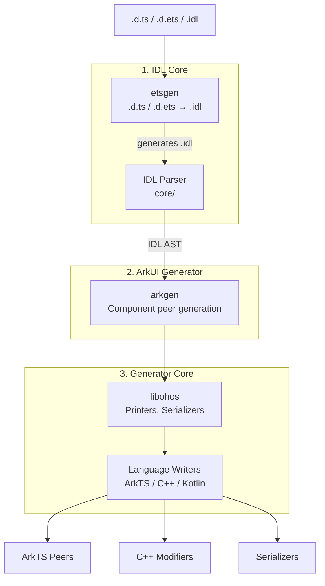

# <p>  IDLize <p/>

[中文文档](README_zh.md)

## What is IDLize

IDLize is a compiler toolchain for the OpenHarmony/ArkUI ecosystem that
ingests interface declarations (`.d.ts`, `.d.ets`, `.idl`) and generates
native bindings. Generated artifacts include ArkTS peer classes, C++
libace modifiers, and serialization code for the ArkUI component
framework. The target audience is ArkUI developers who need to define or
process component interfaces for the OpenHarmony platform.

## Architecture



## Quick Start

**Step 1: Clone and install**

```bash
git submodule update --init
npm i
cd external && npm i && cd ..
```

**Step 2: Compile**

```bash
cd runner && npm run compile && cd ..
```

**Step 3: Generate**

```bash
bash generate.sh
```

The generated code will be in `./out`.

## Tools

**Peer Generator** (`arkgen`) -- Generates ArkTS peers, C++ libace
modifiers, and Arkoala bindings from IDL definitions. Primary mode:
`--idl2peer`. See [Developer Guide](doc/en/DEVELOPER_GUIDE.md) and
[CLI Reference](doc/en/CLI_REFERENCE.md).

**IDL Converter** (`etsgen`) -- Converts `.d.ts` and `.d.ets`
declarations to IDL format. Primary mode: `--ets2idl`. See
[CLI Reference](doc/en/CLI_REFERENCE.md).

**Pipeline Runner** (`runner`) -- Orchestrates the end-to-end generation
pipeline via the `m3` command, which chains SDK preparation, IDL
conversion, scraping, peer generation, and output installation. See
[CLI Reference](doc/en/CLI_REFERENCE.md).

**Linters** -- The `.d.ts` linter (`@idlizer/linter`) and the `.idl`
linter (`@idlizer/idlinter`) validate interface declarations for quality
and correctness.

**IDL Generator** (`dtsgen`) -- Generates `.d.ts` declarations from IDL
definitions (the reverse direction of `etsgen`).

## Documentation

### For Tool Users

| Document | Description |
|----------|-------------|
| [Developer Guide](doc/en/DEVELOPER_GUIDE.md) | ArkUI developer workflow: initial dev, new interfaces, parameter changes |
| [CLI Reference](doc/en/CLI_REFERENCE.md) | Parameters and usage for runner, arkgen, etsgen |
| [IDL Specification](doc/en/IDL_SPEC.md) | IDL language syntax, types, extended attributes |

### For Tool Developers

| Document | Description |
|----------|-------------|
| [Architecture](doc/en/ARCHITECTURE.md) | Tool developer concepts, core modules, UML diagrams |
| [Serialization](doc/en/SERIALIZATION.md) | Types serialization protocol |
| [Callbacks](doc/en/CALLBACKS.md) | Callback and event binding patterns |
| [Limitations](doc/en/LIMITATIONS.md) | Processing pipeline limitations |
| [Performance](doc/en/PERFORMANCE.md) | Performance considerations |
