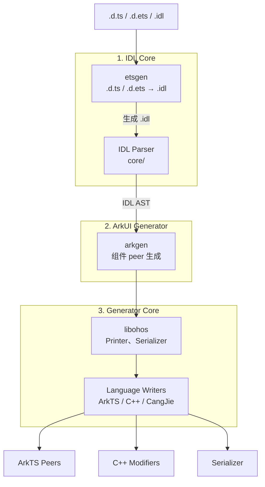

# <p>  IDLize <p/>

[English](README.md)

## IDLize 是什么

IDLize 是面向 OpenHarmony/ArkUI 生态的编译器工具链，用于读取接口声明文件
（`.d.ts`、`.d.ets`、`.idl`）并生成 native bindings。生成的产物包括 ArkTS peer 类、
C++ libace Modifiers，以及 ArkUI 组件框架的序列化代码。目标用户是需要在
OpenHarmony 平台上定义或处理组件接口的 ArkUI 开发者。

## 架构



## 快速开始

**步骤 1：克隆并安装**

```bash
git submodule update --init
npm i
cd external && npm i && cd ..
```

**步骤 2：编译**

```bash
cd runner && npm run compile && cd ..
```

**步骤 3：生成**

```bash
bash generate.sh
```

生成的代码将位于 `./out` 目录。

## 工具

**Peer Generator**（`arkgen`）-- 从 IDL 定义生成 ArkTS peer、C++ libace Modifiers
和 Arkoala 绑定。主要模式：`--idl2peer`。参见
[开发者指南](doc/zh-cn/DEVELOPER_GUIDE.md)和
[CLI 参考](doc/zh-cn/CLI_REFERENCE.md)。

**IDL Converter**（`etsgen`）-- 将 `.d.ts` 和 `.d.ets` 声明转换为 IDL 格式。
主要模式：`--ets2idl`。参见[CLI 参考](doc/zh-cn/CLI_REFERENCE.md)。

**Pipeline Runner**（`runner`）-- 通过 `m3` 命令编排端到端生成管线，依次执行
SDK 准备、IDL 转换、抓取、peer 生成和输出安装。参见
[CLI 参考](doc/zh-cn/CLI_REFERENCE.md)。

**代码检查工具** -- `.d.ts` 检查工具（`@idlizer/linter`）和 `.idl` 检查工具
（`@idlizer/idlinter`）用于验证接口声明的质量和正确性。

**IDL Generator**（`dtsgen`）-- 从 IDL 定义生成 `.d.ts` 声明（与 `etsgen`
相反的方向）。

## 文档

### 工具用户文档

| 文档 | 说明 |
|------|------|
| [开发者指南](doc/zh-cn/DEVELOPER_GUIDE.md) | ArkUI 开发者工作流：初始开发、新接口、参数变更 |
| [CLI 参考](doc/zh-cn/CLI_REFERENCE.md) | runner、arkgen、etsgen 的参数和用法 |
| [IDL 规范](doc/zh-cn/IDL_SPEC.md) | IDL 语言语法、类型、扩展属性 |

### 工具开发者文档

| 文档 | 说明 |
|------|------|
| [架构](doc/zh-cn/ARCHITECTURE.md) | 工具开发者概念、核心模块、UML 图 |
| [序列化](doc/zh-cn/SERIALIZATION.md) | 类型序列化协议 |
| [回调](doc/zh-cn/CALLBACKS.md) | 回调与事件绑定模式 |
| [限制](doc/zh-cn/LIMITATIONS.md) | 处理管线的限制 |
| [性能](doc/zh-cn/PERFORMANCE.md) | 性能相关注意事项 |
