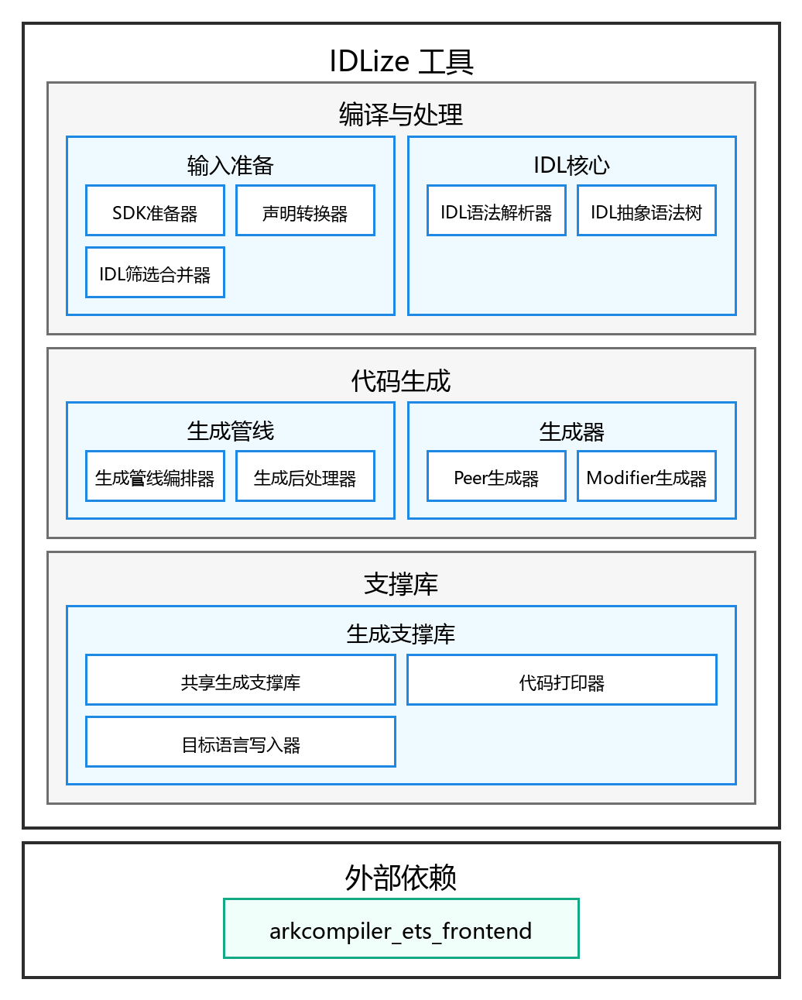

# IDLize 工具

<p></p>


## 简介

IDLize 是给 ArkUI 开发使用的编译期代码生成工具，用于读取接口声明文件
（`.d.ets`、`.idl`）并生成代码。生成代码产物包括 ArkTS 层代码、
C++ 层代码，以及 ArkTS 层和 C++ 层之间进行回调和类型转换的序列化代码。

本仓库属于 ArkUI 子系统，为 ArkUI 开发提供代码生成工具。更多 ArkUI
框架子系统相关概念，请参考
[ArkUI 框架子系统 README](https://gitcode.com/openharmony/docs/blob/master/zh-cn/readme/ArkUI%E6%A1%86%E6%9E%B6%E5%AD%90%E7%B3%BB%E7%BB%9F.md)。

> **本文档面向谁。** 本 README 主要面向**IDLize 工具开发者**，用于为生成器增加能力、维护生成器功能，或排查生成结果。如果只是想**使用** IDLize 生成 ArkUI 代码，请从 [作为工具使用 IDLize](#作为工具使用-idlize) 开始阅读。

### 核心概念

**FrameNode**
ArkUI 的 C++ 层组件节点，表示 ArkUI 树中的一个组件实例。它保存属性、布局和渲染所需
的状态。

**Peer**
由 IDLize 工具生成的 ArkTS 层类，用于暴露组件的属性和方法，并转发属性设置等操作到 C++ 层的组件上。

**Modifier**
由 IDLize 工具生成的 C++ 层类，用于将组件属性的变化传递到 FrameNode。

**Serializer**
由 IDLize 工具生成的序列化代码，用于在 ArkTS 层和 C++ 层之间进行类型转换。

### 架构

**图 1** IDLize 架构图



### 架构说明

IDLize 工具主要由编译与处理、代码生成、支撑库三大模块组成。

#### 编译与处理模块

负责把外部 SDK、补充接口和手写接口整理成可被生成器稳定消费的统一接口描述。

- 输入准备：负责转换、裁剪和合并输入的接口描述，保证后续处理只面对必要且一致的接口集合。
  - SDK 准备器：对 OHOS SDK 进行前处理，提取 ArkUI 代码生成所需的接口声明文件。
  - 声明转换器：读取 ArkTS 风格的声明文件，将类、接口、枚举、属性、方法和组件信息转换为统一的接口描述文件。
  - IDL 筛选合并器：把转换得到的接口文件和额外补充的接口文件放在一起整理，挑出生成 ArkUI 组件真正需要的部分，去掉无关内容，并生成后续生成器需要的模块配置。
- IDL 核心：负责理解统一接口描述，并把文本形式的接口内容变成结构化的语义模型，供所有生成器共享。
  - IDL 语法解析器：读取接口描述文本，识别包、命名空间、接口、枚举、属性、方法、类型和扩展信息，并在格式错误时给出诊断。
  - IDL 抽象语法树：以树状结构保存接口文件中的所有声明、类型关系、继承关系和位置信息，是后续筛选、转换和生成的基础。

#### 代码生成模块

负责把统一接口描述转换成 ArkUI 需要的 ArkTS 层代码、C++ 层代码、序列化逻辑和工程集成文件。

- 生成管线：负责组织生成前后的完整流程，让接口描述能够稳定变成目标目录中的生成产物。
  - 生成管线编排器：按顺序串联输入准备、接口解析、代码生成和格式整理。
  - 生成后处理器：处理生成后的格式化和输出目录整理，使生成结果可以直接进入下游工程。
- 生成器：负责围绕组件和接口关系生成不同组件的代码，每类生成器服务于一条明确的运行链路。
  - Peer 生成器：生成 ArkTS 层组件封装，负责创建组件对应的 ArkTS 层节点，保存跨语言调用所需句柄，并把属性和方法调用转发到 C++ 层。
  - Modifier 生成器：生成属性更新链路，记录、合并和应用属性变化，并提供 C++ 层可调用的更新入口，把属性变更落到 ArkUI 节点上。

#### 支撑库

负责提供生成过程中反复使用的公共能力，避免各生成器重复处理文件布局、缩进输出、类型写法和目标语言差异。

- 生成支撑库：负责把生成片段组织成完整文件，并统一处理依赖收集、输出路径、命名空间、版权提示和语言外壳。
  - 共享生成支撑库：提供组件收集、依赖收集、文件布局、模块导入、序列化辅助等公共生成能力。
  - 代码打印器：负责按层级输出文本，维护缩进、拼接片段和写入文件，保证生成代码结构清晰稳定。
  - 目标语言写入器：把类、接口、方法、属性、条件、循环、导入和类型转换等通用生成动作转换成不同目标语言的具体写法。

#### 外部依赖

为声明读取和 ArkTS 语法理解提供底层能力，是声明转换阶段能够准确识别 ArkTS 接口结构的基础。

- arkcompiler_ets_frontend：负责提供 ArkTS 声明解析能力，使工具能够读取 SDK 中的 ArkTS 接口结构，并转换为后续生成使用的统一接口描述。

## 目录

仓库根目录包含以下关键目录：

```text
/arkui_idlize
├── arkgen                 # ArkUI 代码生成器
├── core                   # IDL 抽象语法树的核心定义
├── doc                    # 工具使用者文档
├── doc_developer          # 工具开发者文档
├── etsgen                 # .d.ets 到 IDL 的转换器
├── idlinter               # .idl 文件语法检查器
├── libohos                # 代码生成支撑库
├── runner                 # 生成管线编排器
├── scraper                # SDK 预处理工具
└── tools                  # 仓库打包发布工具
```

## 编译构建/使用方法

### 构建开发环境

**前置条件：** Node.js 18 或更高版本，以及 git。

1. 克隆子模块并安装根目录依赖。

```bash
git submodule update --init
npm i
cd external
npm i
cd ..
```

2. 编译管线入口。

```bash
cd runner
npm run compile
cd ..
```

3. 下载 OHOS SDK。

```bash
npm run download:sdk
```

以上命令无错误完成后，开发环境即准备完成。

### 运行标准生成流程

在仓库根目录运行标准管线：

```bash
bash generate.sh
```

执行完成后的生成输出位于 `./out` 目录；管线中间产物位于 `runner/out`。

### 常见问题与排查

| 现象 | 检查项 | 处理方法 |
|---|---|---|
| `node` 或 `npm` 报版本或语法错误 | 在仓库根目录执行 `node -v`。 | 使用 Node.js 18 或更高版本；必要时重新安装依赖。 |
| 在 `external/` 中执行 `npm run compile` 失败 | 先重新执行 `cd external && npm i`。 | 编译前必须先安装 `external/` 及其子模块依赖。 |
| 生成结果缺少预期 API | 对比 `out/`、`runner/out/peers/` 和 `runner/out/idl/`。 | 确认 SDK 声明无误，然后重新执行 `bash generate.sh`。 |

如需深入排查，请参考 [追踪生成结果](doc/zh-cn/USER_GUIDE.md#3-判断生成结果是否正确) 和
[调试路径](doc_developer/zh-cn/ARCHITECTURE.md#6-调试路径)。

## 说明

### 接口说明

IDLize 通过 npm 提供命令行工具。

| 工具 | npm 包 | 功能 |
|---|---|---|
| ArkUI 代码生成器 | `arkgen` | 从 IDL 定义生成 ArkTS peer、C++ libace modifier 和 Arkoala 绑定。 |
| IDL 转换器 | `etsgen` | 将 `.d.ts` 和 `.d.ets` 声明转换为 IDL 格式。 |
| 生成管线编排工具 | `runner` | 编排 SDK 准备、IDL 转换、抓取、peer 生成和输出安装，驱动标准生成流程。 |
| 声明检查工具 | `linter`、`idlinter` | 验证 `.d.ts`、`.d.ets` 和 `.idl` 声明。 |

命令参数和示例请参考 [工具使用者指南](doc/zh-cn/USER_GUIDE.md)、
[CLI 参考](doc/zh-cn/CLI_REFERENCE.md) 和 [IDL 规范](doc/zh-cn/IDL_SPEC.md)。

### 作为工具使用 IDLize

工具使用者通常提供 SDK 声明或手写 IDL，运行管线，然后使用生成的代码。

```bash
bash generate.sh
```

## 文档

### 工具开发者文档

| 文档 | 说明 |
|---|---|
| [工具开发者指南](doc_developer/zh-cn/DEVELOPER_GUIDE.md) | 面向工具开发者的环境搭建、开发流程、核心概念和代码导览。 |
| [架构设计](doc_developer/zh-cn/ARCHITECTURE.md) | 管线架构和各工作区职责。 |

### 工具使用者文档

| 文档 | 说明 |
|---|---|
| [工具使用者指南](doc/zh-cn/USER_GUIDE.md) | IDLize 工具使用者工作流：初始生成、新接口、参数变更。 |
| [CLI 参考](doc/zh-cn/CLI_REFERENCE.md) | `runner` 的参数和用法。 |
| [IDL 规范](doc/zh-cn/IDL_SPEC.md) | IDL 语言语法、类型和扩展属性。 |

## 相关仓

[ArkUI 框架子系统](https://gitcode.com/openharmony/docs/blob/master/zh-cn/readme/ArkUI%E6%A1%86%E6%9E%B6%E5%AD%90%E7%B3%BB%E7%BB%9F.md)

[arkui_ace_engine](https://gitcode.com/openharmony/arkui_ace_engine)

[arkui_ace_engine_lite](https://gitcode.com/openharmony/arkui_ace_engine_lite)

[arkui_napi](https://gitcode.com/openharmony/arkui_napi)

[**arkui_idlize**](https://gitcode.com/openharmony-sig/arkui_idlize)
