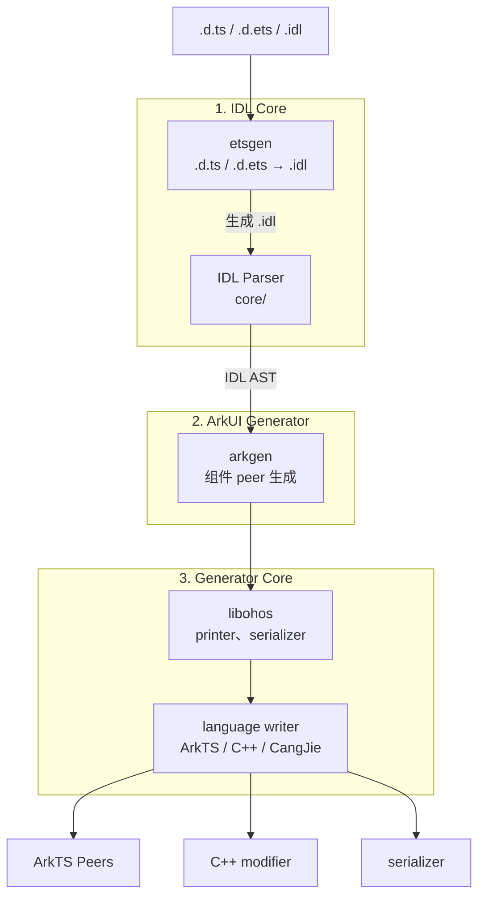

# <p>  IDLize <p/>

[English](README.md)

## IDLize 是什么

IDLize 是面向 OpenHarmony/ArkUI 生态的编译器工具链，用于读取接口声明文件
（`.d.ts`、`.d.ets`、`.idl`）并生成原生绑定代码。生成的产物包括 ArkTS peer 类、
C++ libace modifier，以及 ArkUI 组件框架的序列化代码。目标用户是需要在
OpenHarmony 平台上定义或处理组件接口的 ArkUI 开发者。

## 架构



## 核心概念

**peer**
一个生成的类，镜像了 ArkUI 组件的 API 接口。每个 peer 封装一个原生
framenode，并将组件的属性和方法暴露给应用层。

**modifier**
一个生成的 C++ 对象，在运行时将属性变更应用到 framenode。Modifier 在
ArkTS peer 层和原生 ArkUI 渲染引擎之间搭建桥梁，将属性 setter 转换为
原生调用。

**serializer**
生成的代码，用于为进程间通信（IPC）调用编码属性值。Serializer 将 IDL
表示中的类型值转换为适合跨越 ArkTS/C++ 边界的线路格式。

**framenode**
一个原生 ArkUI 树节点，是 modifier 的运行时目标。UI 树中的每个可见组件
都对应一个 framenode；modifier 和 peer 操作 framenode 以更新属性、布局
和渲染状态。

**materialized**
一个组件，其 peer 是根据 IDL 定义完整生成的，而非 stub。
Materialization 通过 `arkgen/generation-config/config.json` 逐组件控制。
未被 materialized 的组件仅生成最小的 stub。

## 快速开始

**步骤 1：克隆并安装**

```bash
git submodule update --init
npm i
cd external && npm i && cd ..
```

**步骤 2：准备 libarkts**

```bash
cd external/libarkts
PANDA_SDK_VERSION=1.5.0-dev.58082 npm run panda:sdk:reinstall
npm run compile
cd ../..
```

**步骤 3：编译管线**

```bash
cd runner && npm run compile && cd ..
```

**步骤 4：下载并准备 SDK**

```bash
npm run download:sdk
```

**步骤 5：生成**

```bash
bash generate.sh
```

安装后的生成输出位于 `./out` 目录；管线中间产物位于 `runner/out`。

## 工具

**Peer Generator**（`arkgen`）-- 从 IDL 定义生成 ArkTS peer、C++ libace modifier
和 Arkoala 绑定。主要模式：`--idl2peer`。参见
[开发者指南](doc/zh-cn/DEVELOPER_GUIDE.md)。

**IDL Converter**（`etsgen`）-- 将 `.d.ts` 和 `.d.ets` 声明转换为 IDL 格式。
主要模式：`--ets2idl`。

**Pipeline Runner**（`runner`）-- 通过 `m3` 命令编排端到端生成管线，依次执行
SDK 准备、IDL 转换、抓取、peer 生成和输出安装。参见
[CLI 参考](doc/zh-cn/CLI_REFERENCE.md)。

**代码检查工具** -- `.d.ts` 检查工具（`@idlizer/linter`）和 `.idl` 检查工具
（`@idlizer/idlinter`）用于验证接口声明的质量和正确性。

**IDL Generator**（`dtsgen`）-- 从 IDL 定义生成 `.d.ts` 声明（与 `etsgen`
相反的方向）。

## 文档

### 工具用户文档

| 文档 | 说明 |
|------|------|
| [开发者指南](doc/zh-cn/DEVELOPER_GUIDE.md) | ArkUI 开发者工作流：初始开发、新接口、参数变更 |
| [CLI 参考](doc/zh-cn/CLI_REFERENCE.md) | runner 的参数和用法 |
| [IDL 规范](doc/zh-cn/IDL_SPEC.md) | IDL 语言语法、类型、扩展属性 |

