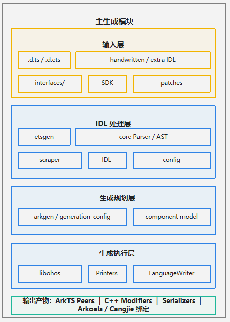

# IDLize部件

<p></p>

[English](README.md)

## 简介

IDLize是面向OpenHarmony ArkUI的编译期生成器工具，用于读取接口声明文件
（`.d.ets`、`.idl`）并生成代码。生成代码产物包括ArkTS类、
C++ Modifier，以及ArkTS层和C++层之间进行回调和类型转换的序列化代码。

本仓库属于ArkUI子系统，为ArkUI开发提供代码生成工具，
用于为ArkUI生成面向ArkTS、仓颉（华为编程语言）等目标语言的代码。更多ArkUI
框架子系统相关概念，请参考
[ArkUI框架子系统README](https://gitcode.com/openharmony/docs/blob/master/zh-cn/readme/ArkUI%E6%A1%86%E6%9E%B6%E5%AD%90%E7%B3%BB%E7%BB%9F.md)
（中文）。

> **本文档面向谁。** 本README主要面向**IDLize工具开发者**，用于为生成器
> 增加能力、维护生成器功能，或排查生成结果。如果你只是想**使用**IDLize生成
> ArkUI代码，请从[作为工具使用IDLize](#作为工具使用idlize)开始阅读。

### 核心概念

**Arkoala**
Arkoala是多语言ArkUI运行时项目，用于消费IDLize生成的绑定代码。本仓库中与
Arkoala相关的产物包括peer接口、语言绑定，以及面向ArkTS、Cangjie等目标的
序列化胶水代码。

**FrameNode**
ArkUI的C++层组件节点，表示ArkUI树中的一个组件实例。它保存属性、布局和渲染所需
的状态。

**Peer**
由IDLize工具生成的ArkTS层类，Peer类用于暴露组件的属性和方法，并把对应
FrameNode的更新转发到C++侧。

**Modifier**
由IDLize工具生成的C++层struct，用于将属性的变化传递到FrameNode。

**Serializer**
由IDLize工具生成的序列化代码，用于在ArkTS层和C++层之间进行类型转换。

### 架构



图1 IDLize架构图

IDLize使用如下管线：

1. `scraper/`拉取并规范化外部SDK内容。
2. `etsgen/`将`.d.ts`和`.d.ets`声明转换为`.idl`。
3. `core/`解析IDL文件并构建IDL抽象语法树（AST）。
4. `arkgen/`和`libohos/`遍历AST，输出ArkTS peer、C++ libace modifier、
   serializer和Arkoala胶水代码。
5. `runner/`将生成结果安装到目标目录。

## 目录

仓库根目录包含以下关键目录：

```text
/arkui_idlize
├── arkgen                 # ArkUI组件生成器
├── core                   # IDL AST的核心定义
├── doc                    # 工具使用者文档
├── doc_developer          # 工具开发者文档
├── etsgen                 # .d.ets到IDL的转换器
├── idlinter               # .idl文件语法检查器
├── libohos                # printer、serializer和peer基础设施
├── runner                 # 端到端生成管线编排器
├── scraper                # SDK预处理工具
└── tools                  # 仓库搭建、SDK下载和发布工具
```

## 编译构建/使用方法

### 构建开发环境

**前置条件：** Node.js 18 或更高版本，以及 git。

1. 克隆子模块并安装根目录依赖。

```bash
git submodule update --init
npm i
cd external
npm i
cd ..
```

2. 编译管线入口。

```bash
cd runner
npm run compile
cd ..
```

3. 下载OHOS SDK。

```bash
npm run download:sdk
```

以上命令无错误完成后，开发环境即准备完成。

### 运行标准生成流程

在仓库根目录运行标准管线：

```bash
bash generate.sh
```

执行完成后的生成输出位于`./out`目录；管线中间产物位于`runner/out`。

### 常见问题与排查

| 现象 | 检查项 | 处理方法 |
|---|---|---|
| `node`或`npm`报版本或语法错误 | 在仓库根目录执行`node -v`。 | 使用Node.js 18或更高版本；必要时重新安装依赖。 |
| 在`external/`中执行`npm run compile`失败 | 先重新执行`cd external && npm i`。 | 编译前必须先安装`external/`及其子模块依赖。 |
| 生成结果缺少预期API | 对比`out/`、`runner/out/peers/`和`runner/out/idl/`。 | 确认SDK声明无误，然后重新执行`bash generate.sh`。 |

如需深入排查，请参考[追踪生成结果](doc/zh-cn/USER_GUIDE.md#3-判断生成结果是否正确)和
[调试路径](doc_developer/zh-cn/ARCHITECTURE.md#6-调试路径)。

## 说明

### 接口说明

IDLize通过npm提供命令行工具。

| 工具 | npm包 | 功能 |
|---|---|---|
| ArkUI代码生成器 | `arkgen` | 从IDL定义生成ArkTS peer、C++ libace modifier和Arkoala绑定。 |
| IDL转换器 | `etsgen` | 将`.d.ts`和`.d.ets`声明转换为IDL格式。 |
| 生成管线编排工具 | `runner` | 编排SDK准备、IDL转换、抓取、peer生成和输出安装，驱动标准生成流程。 |
| 声明检查工具 | `linter`、`idlinter` | 验证`.d.ts`、`.d.ets`和`.idl`声明。 |

命令参数和示例请参考[工具使用者指南](doc/zh-cn/USER_GUIDE.md)、
[CLI参考](doc/zh-cn/CLI_REFERENCE.md)和[IDL规范](doc/zh-cn/IDL_SPEC.md)。

### 作为工具使用IDLize

工具使用者通常提供SDK声明或手写IDL，运行管线，然后使用生成的代码。

```bash
bash generate.sh
```

## 文档

### 工具开发者文档

| 文档 | 说明 |
|---|---|
| [工具开发者指南](doc_developer/zh-cn/DEVELOPER_GUIDE.md) | 面向工具开发者的环境搭建、开发流程、核心概念和代码导览。 |
| [架构设计](doc_developer/zh-cn/ARCHITECTURE.md) | 管线架构和各工作区职责。 |

### 工具使用者文档

| 文档 | 说明 |
|---|---|
| [工具使用者指南](doc/zh-cn/USER_GUIDE.md) | IDLize工具使用者工作流：初始生成、新接口、参数变更。 |
| [CLI参考](doc/zh-cn/CLI_REFERENCE.md) | `runner`的参数和用法。 |
| [IDL规范](doc/zh-cn/IDL_SPEC.md) | IDL语言语法、类型和扩展属性。 |

## 相关仓

[ArkUI框架子系统](https://gitcode.com/openharmony/docs/blob/master/zh-cn/readme/ArkUI%E6%A1%86%E6%9E%B6%E5%AD%90%E7%B3%BB%E7%BB%9F.md)

[arkui_ace_engine](https://gitcode.com/openharmony/arkui_ace_engine)

[arkui_ace_engine_lite](https://gitcode.com/openharmony/arkui_ace_engine_lite)

[arkui_napi](https://gitcode.com/openharmony/arkui_napi)

[**arkui_idlize**](https://gitcode.com/openharmony-sig/arkui_idlize)
