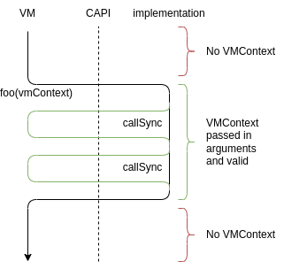
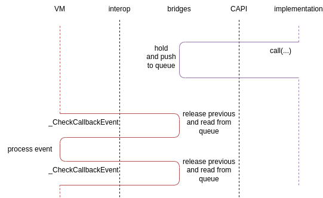

# 回调

## 理解回调

这里你可以找到 CAPI 中回调使用的示例，包含简单示例和常见问题列表。

### 术语

**资源**（或 **CallbackResource**）— 包含数字标识符 `resourceId`（目前为 int32）、`hold` 和 `release` 函数指针，签名为 `void(int32)` 的集合。

* resourceId — 资源的唯一标识符，其用途由资源创建者定义。例如，对于托管侧回调，resourceId 可能是映射 `Map<int, () => void>` 中的键，其中每个 resourceId 对应一个闭包。
* hold — 被调用以增加资源引用计数的函数。
* release — 被调用以减少资源引用计数的函数。

hold 和 release 的具体实现由资源的创建者决定。

**回调** — 包含资源、`call` 和 `callSync` 函数指针的集合。`call` 的签名为 `void (int32 resourceId, [callbackArg0, ..., callbackArgN] [ContinuationType continuation])`。`callSync` 的签名与 `call` 基本相同，但会在最前面增加一个 `VMContext` 参数。

**VMContext** — 虚拟机上下文，在部分 API 调用中传入。用于通过 napi/ani/ets_napi 等（取决于虚拟机类型）调用 VM。CAPI 不提供关于 VMContext 具体是什么的任何信息。

**continuation** — 用于返回父回调执行结果的回调。

### Hold、Release 和调用上下文 <a id='hold-release-and-call-context'></a>

C 语言没有内置的方式来跟踪数据的引用计数，只有纯数据的函数。因此你必须始终仔细控制是否已用 `hold` 函数增加了引用。<a id='callback-context-convention'></a>按照约定，如果包含 Resource 的结构通过函数参数传入，引用计数器将始终不为零，以给你控制资源的机会。但如果你想在函数上下文之外保持资源，必须手动调用 `hold` 函数。

正确用法（回调在 `foo` 上下文内被调用，此时引用计数不为零）：

```c++
typedef struct Callback_Void {
    CallbackResource resource;
    void (*call)(int32_t resourceId);
    void (*callSync)(VMContext vmContext, int32_t resourceId);
} Callback_Void;

void foo(const Callback_Void *cb) {
    cb->call(cb->resource.resourceId); // 引用计数 > 0，因为在上下文中
    cb->call(cb->resource.resourceId); // 引用计数 > 0，因为在上下文中
}
```

正确用法 — 回调在 `subscribe` 上下文之外被调用，但已调用了 hold。当回调不再需要时，调用了 release：

```c++
bool g_isValid = false;
Callback_Void g_cb;
void subscribe(const Callback_Void *cb) {
    g_cb = *cb; // 引用计数 > 0，因为在上下文中
    g_isValid = true; // 引用计数 > 0，因为在上下文中
    g_cb.resource.hold(g_cb.resource.resourceId) // 保持引用
}
void emit() {
    if (g_isValid) {
        g_cb.call(g_cb.resource.resourceId); // 已保持引用
    }
}
void unsubscribe(const Callback_Void *cb) {
    if (g_isValid) {
        g_isValid = false; // 已保持引用
        g_cb.resource.release(g_cb.resource.resourceId) // 已释放，引用计数未指定
    }
}
```

错误用法 — 保存了指向资源的指针而不是结构数据。请记住，CAPI 参数中的指针仅用于优化传递数据的大小：

```c++
bool g_isValid = false;
const Callback_Void *g_cb;
void subscribe(const Callback_Void *cb) {
    g_cb = cb;
    g_isValid = true;
    // ...
}
void emit() {
    if (g_isValid) {
        g_cb->call(g_cb->resource.resourceId); // g_cb 指向的内存不保证有效
    }
}
```

错误用法 — 未调用 hold 且回调在 `subscribe` 上下文之外使用：

```c++
bool g_isValid = false;
Callback_Void g_cb;
void subscribe(const Callback_Void *cb) {
    g_cb = *cb; // 引用计数 > 0，因为在上下文中
    g_isValid = true; // 引用计数 > 0，因为在上下文中
}
void emit() {
    if (g_isValid) {
        cb->call(cb->resource.resourceId); // 引用计数未指定
    }
}
```

### 创建自己的回调

回调基于非常基本的规则，但使用不同的包装器可以编写可读性更好的代码。以下是从 C++ lambda 表达式创建回调的最简单示例：

```c++
typedef struct Callback_Int32_Void {
    CallbackResource resource;
    void (*call)(int32_t resourceId, int32_t value);
    void (*callSync)(VMContext vmContext, int32_t resourceId, int32_t value);
} Callback_Int32_Void;

struct CallbackInfo {
    std::function<void(int32_t)> handler;
    int32_t counter = 0;
};

int32_t g_nextResourceId = 1;
std::map<int32_t, CallbackInfo> g_resouceIdToCallback;

void holdImpl(int32_t resourceId) {
    g_resouceIdToCallback[resourceId].counter++;
}

void releaseImpl(int32_t resourceId) {
    g_resouceIdToCallback[resourceId].counter--;
    if (g_resouceIdToCallback[resourceId].counter == 0)
        g_resouceIdToCallback.erase(resourceId);
}

void callImpl(int32_t resourceId, int32_t value) {
    g_resouceIdToCallback[resourceId](value);
}

void callSyncImpl(VMContext _, int32_t resourceId, int32_t value) {
    g_resouceIdToCallback[resourceId](value);
}

Callback_Int32_Void lambdaToCallback(std::function<void(int32_t)>&& lambda) {
    int32_t resourceId = g_nextResourceId++;
    g_resouceIdToCallback[resourceId] = {
        lambda,
        1,
    };
    return {
        {   // CallbackResource
            resourceId,     // resourceId
            holdImpl,       // hold
            releaseImpl,    // release
        },
        callImpl,       // call
        callSyncImpl,   // callSync
    }
}

void subscribe(const Callback_Int32_Void *cb) {
    // 做一些事情
}

void main() {
    Callback_Int32_Void cb = lambdaToCallback([](int32_t value) {
        printf("%d\n", value);
    })
    subscribe(&cb);
    cb.resource.release(cb.resource.resourceId);
}
```

这段代码是能做的最基本的事情。使用 C++ 模板可以创建更舒适的包装器，
如 arkui_ace_engine 中的实现（参见 [callback_helper.h](https://gitee.com/openharmony/arkui_ace_engine/blob/OpenHarmony_ArkUI_Upstream_2024/frameworks/core/interfaces/native/utility/callback_helper.h)、[callback_keeper.h](https://gitee.com/openharmony/arkui_ace_engine/blob/OpenHarmony_ArkUI_Upstream_2024/frameworks/core/interfaces/native/utility/callback_keeper.h)）。

### 延续 <a id='continuations'></a>

延续（continuation）是一种把回调执行结果传回调用方的方式。本质上，它用一个额外回调来表示源 IDL 声明中的返回值。

假设有以下 IDL 回调声明：

```
callback Foo = i32 ();
```

对于 TypeScript，该类型可以表示为：

```typescript
type Foo = () => number
```

对于此回调，CAPI 中的有效生成为：

```c++
typedef struct Callback_Int32_Void {
    CallbackResource resource;
    void (*call)(int32 resourceId, int32 value);
    void (*callSync)(VMContext vmContext, int32 resourceId, int32 value);
} Callback_Number_Void;

typedef struct Foo {
    CallbackResource resource;
    void (*call)(int32 resourceId, Callback_Int32_Void continuation);
    void (*callSync)(VMContext vmContext, int32 resourceId, Callback_Int32_Void continuation);
} Foo;
```

你可以看到，Foo 结构体的 call 和 callSync 字段中有 `continuation` 参数，其类型是回调，带有单个参数，类型与源 IDL 声明中的返回类型相同。

用法：

```c++
void foo(Foo cb) {
    Callback_Int32_Void continuation = lambdaToCallback([](int32_t value) {
        printf("%d\n", value);
    });
    cb.call(cb.resourceId, continuation);
    continuation.resource.release(continuation.resource.resourceId);
}
```

### 同步调用

每个回调有两个函数：call 和 callSync。第一个是异步的 — 它可以被排队并在稍后执行，continuation 参数也是如此。这种方式在大多数情况下是好的，因为它减少了对 VM 的反向调用并有更好的多线程优化。但有时你需要立即获得调用结果 — 这就是 `callSync` 的用途。

同步调用签名有必需的 `VMContext` 参数。它不能在任何时候获取，只在 VM 调用内部可用：

```c++
Callback_Void g_cb;
void foo(VMContext vmContext) {
    g_cb.callSync(g_cb.resourceId, vmContext);
    g_cb.callSync(g_cb.resourceId, vmContext);
}
```



全局存储 VMContext 然后使用它可能导致不可预测的行为，请谨慎使用。

```c++
VMContext g_vmContext;
void foo(VMContext vmConvext) {
    g_vmContext = vmContext; // 不要这样做
}

Callback_Void g_cb;
void boo() {
    g_cb.callSync(g_cb.resourceId, g_vmContext); // 不要这样做
}
```

最佳选择是使用异步调用，否则你必须在 API 中显式请求 VMContext。

```c++
void boo() {
    // 最佳方式
    g_cb.call(g_cb.resourceId, g_vmContext);
}
void boo(VMContext vmContext) {
    // 影响优化，但也可接受
    g_cb.callSync(g_cb.resourceId, vmContext);
}
```

<div style="page-break-before:always"></div>

## 托管与桥接回调

### 概述

本节介绍通用回调管线 — 回调如何在托管层和原生层之间传递、它们的调用如何分发等等。

将托管闭包传递到原生 CAPI 结构。

1. 拥有已知签名的托管闭包。
2. 闭包在 ResourceHolder 中注册并转换为基本类型值（参见 [托管层：闭包序列化](#managed-closure-serialization)）。
3. 在原生调用中，callSync、hold 和 release 被填充函数指针（参见 [桥接：hold 和 release](#bridges-hold-release)、[桥接：call 和 callSync](#bridges-call-callSync)）。
4. CAPI 术语中的回调结构被传递到相应的 CAPI 方法调用。

将原生 CAPI 结构转换为托管闭包。

1. 拥有某个序列化的回调 — 包含 resourceId、hold、release、call 和 callSync 值的集合。
2. 读取这些值并创建托管闭包。在闭包内部，参数被序列化，并与回调信息一起传递给 `_CallCallbackSync` 或 `_CallCallback`。参见 [托管层：闭包反序列化](#managed-closure-deserialization)。
3. 闭包可以被调用了。

在 CAPI 中调用从托管闭包创建的回调。

1. 拥有描述来自托管侧回调的 CAPI 结构。`call` 或 `callSync` 已被调用（即已被执行）。
2. `callManagedSmth` 或 `callManagedSmthSync`（即 call 或 callSync 的本质，参见 [桥接：call 和 callSync](#bridges-call-callSync)）被调用。
3. 回调参数被序列化。根据同步或异步调用，托管函数被调用或回调被放入队列稍后调用（参见 [桥接：通用事件](#bridges-general-events)）。
4. 在托管侧接收到回调参数后，它们被反序列化，从 ResourceHolder 获取闭包实例并调用（参见 [托管层：反序列化参数并调用闭包](#managed-deserialize-and-call)）。如果闭包的返回类型不是 void，则使用接收到的结果调用 continuation 回调（参见 [延续](#continuations)）。

在托管层调用从 CAPI 表示反序列化的回调。

1. 拥有从 CAPI 结构转换的托管闭包。闭包被调用。
2. 闭包参数被序列化，并调用 `_CallCallbackSync` 或 `_CallCallback`。参见 [托管层：闭包反序列化](#managed-closure-deserialization)。
3. 在原生层，参数被反序列化，并调用初始 CAPI 表示的 `call` 或 `callSync`。参见 [桥接：反序列化参数并调用闭包](#native-deserialize-and-call)。

### 托管层：闭包序列化 <a id='managed-closure-serialization'></a>

在托管侧，回调就是闭包。因此，在通过互操作传递之前，我们需要将其表示为类似 CAPI 的数据，包含 Resource、call 和 callSync。

```
// idl
callback Foo = void ();
void foo(Foo cb);
```

这里是通过 IDL 声明的全局函数 `foo`，带有函数类型参数 `Foo cb`。该函数的 TypeScript 实现如下：

```typescript
// typescript
function foo(cb: Foo): void {
    const thisSerializer: SerializerBase = SerializerBase.hold()
    thisSerializer.holdAndWriteCallback(cb)
    OHOSNativeModule._GlobalScope_foo(thisSerializer.asBuffer(), thisSerializer.length())
    thisSerializer.release()
}
```

目前序列化到缓冲区是通过互操作传递非基本数据的方式。因此，回调通过 holdAndWriteCallback 函数写入 SerializerBase：

```typescript
class SerializerBase {
    // ...
    holdAndWriteCallback(callback: object, hold: KPointer = 0, release: KPointer = 0, call: KPointer = 0, callSync: KPointer = 0): ResourceId {
        const resourceId = ResourceHolder.instance().registerAndHold(callback)
        this.heldResources.push(resourceId)
        this.writeInt32(resourceId)
        this.writePointer(hold)
        this.writePointer(release)
        this.writePointer(call)
        this.writePointer(callSync)
        return resourceId
    }
    // ...
}
```

让我们逐行分析这个函数。

```typescript
const resourceId = ResourceHolder.instance().registerAndHold(callback)
```

TypeScript 闭包在这里被转换为某个 resourceId。ResourceManager 是一个非常简单的类，允许将某个托管侧对象与唯一标识符关联并计数该标识符的引用计数：

```typescript
export type ResourceId = int32

interface ResourceInfo {
    resource: object
    holdersCount: int32
}

export class ResourceHolder {
    private static nextResourceId: ResourceId = 100
    private resources: Map<ResourceId, ResourceInfo> = new Map<ResourceId, ResourceInfo>()

    public hold(resourceId: ResourceId) {
        if (!this.resources.has(resourceId))
            throw new Error(`Resource ${resourceId} does not exist, can not hold`)
        this.resources.get(resourceId)!.holdersCount++
    }

    public release(resourceId: ResourceId) {
        if (!this.resources.has(resourceId))
            throw new Error(`Resource ${resourceId} does not exist, can not release`)
        const resource = this.resources.get(resourceId)!
        resource.holdersCount--
        if (resource.holdersCount <= 0)
            this.resources.delete(resourceId)
    }

    public registerAndHold(resource: object): ResourceId {
        const resourceId = ResourceHolder.nextResourceId++
        this.resources.set(resourceId, {
            resource: resource,
            holdersCount: 1,
        })
        return resourceId
    }

    public get(resourceId: ResourceId): object {
        if (!this.resources.has(resourceId))
            throw new Error(`Resource ${resourceId} does not exist`)
        return this.resources.get(resourceId)!.resource
    }

    public has(resourceId: ResourceId): boolean {
        return this.resources.has(resourceId)
    }
}
```

<a id='serializer-hold-and-write'></a>在 `this.heldResources.push(resourceId)` 中，持有的资源被记录下来，因为它在互操作函数调用之后[必须被释放](#serializer-release-explanation)。你还记得回调在调用上下文中必须有有效引用计数的[规则](#callback-context-convention)吗？这里的调用上下文是互操作 `OHOSNativeModule._GlobalScope_foo` 函数的调用，release 必须在其之后执行。`heldResources` 数组只是记录了我们持有了哪些资源。

以下几行是回调的精确序列化数据：

```typescript
this.writeInt32(resourceId)
this.writePointer(hold)
this.writePointer(release)
this.writePointer(call)
this.writePointer(callSync)
```

如你所见，resourceId 是有效的数字，但对于 hold、release、call 和 callSync 使用了默认的 `nullptr` 值。原因是所有这些都必须指向某些原生函数，我们将在原生侧反序列化时填充这些字段，在那里我们可以获取原生函数地址：

```c++
// SerializerBase.h
class SerializerBase {
    // ...
    InteropCallbackResource readCallbackResource() {
        InteropCallbackResource result = {};
        result.resourceId = readInt32();
        result.hold = reinterpret_cast<void(*)(InteropInt32)>(readPointerOrDefault(reinterpret_cast<void*>(holdManagedCallbackResource)));
        result.release = reinterpret_cast<void(*)(InteropInt32)>(readPointerOrDefault(reinterpret_cast<void*>(releaseManagedCallbackResource)));
        return result;
    }
    // ...
}

// bridge.cc

void impl_GlobalScope_foo(KSerializerBuffer thisArray, int32_t thisLength) {
    Deserializer thisDeserializer(thisArray, thisLength);
    OHOS_Foo cb_value = {
        thisDeserializer.readCallbackResource(), 
        reinterpret_cast<void(*)(const OH_Int32 resourceId)>(thisDeserializer.readPointerOrDefault(reinterpret_cast<OH_NativePointer>(getManagedCallbackCaller(Kind_Foo)))), 
        reinterpret_cast<void(*)(OH_OHOS_VMContext vmContext, const OH_Int32 resourceId)>(thisDeserializer.readPointerOrDefault(reinterpret_cast<OH_NativePointer>(getManagedCallbackCallerSync(Kind_Foo))))};;
    GetOH_OHOS_API(OHOS_API_VERSION)->GlobalScope()->foo((const OHOS_Foo*)&cb_value);
}
KOALA_INTEROP_DIRECT_V2(GlobalScope_foo, KSerializerBuffer, int32_t)
```

回到托管侧的 `foo` 实现，下一行是互操作 `_GlobalScope_foo` 函数的调用：

```typescript
OHOSNativeModule._GlobalScope_foo(thisSerializer.asBuffer(), thisSerializer.length())
```

这是进入原生的入口点，序列化数据在那里被反序列化，转换为 CAPI 结构，然后调用相应的 CAPI 方法。

<a id='serializer-release-explanation'></a>最后一行释放了在调用 `holdAndWriteCallback` 时[持有的资源](#serializer-hold-and-write)：

```typescript
thisSerializer.release()
```

### 托管层：闭包反序列化 <a id='managed-closure-deserialization'></a>

序列化的闭包总是包含 resourceId 和函数指针的集合，托管侧创建和原生侧创建的回调之间没有区分（在撰写本文时）。

源回调声明：
```
// .idl
callback Foo = void (number value);
```

生成的反序列化代码：
```typescript
class DeserializerBase {
    // ...
    readOHOS_Foo(isSync: boolean = false): Foo {
        const _resource: CallbackResource = this.readCallbackResource()
        const _call: KPointer = this.readPointer()
        const _callSync: KPointer = this.readPointer()
        return (value: number): void => { 
            const _argsSerializer: SerializerBase = SerializerBase.hold();
            _argsSerializer.writeInt32(_resource.resourceId);
            _argsSerializer.writePointer(_call);
            _argsSerializer.writePointer(_callSync);
            _argsSerializer.writeNumber(value);
            (isSync) 
                ? (InteropNativeModule._CallCallbackSync(-1478596844, _argsSerializer.asBuffer(), _argsSerializer.length())) 
                : (InteropNativeModule._CallCallback(-1478596844, _argsSerializer.asBuffer(), _argsSerializer.length()));
            _argsSerializer.release();
            return;
        }
    }
    // ...
}
```

在上面的示例中，你可以看到反序列化签名为 `void (arg: number)` 的回调的过程。本质上结果是一个新的闭包，它序列化参数并使用 `_CallCallbackSync` 或 `_CallCallback` 互操作方法调用 call 或 callSync 函数。在原生侧，参数被反序列化，并使用 call 或 callSync 函数指针进行调用，参见 [桥接：反序列化参数并调用闭包](#native-deserialize-and-call)。

### 托管层：反序列化参数并调用闭包 <a id='managed-deserialize-and-call'></a>

托管参数反序列化与 [桥接：call 和 callSync](#bridges-call-callSync) 是对称的。首先在 deserializeAndCallCallback 中读取回调类型（唯一签名标识符），选择适当的回调解析器：

```typescript
export function deserializeAndCallCallback(thisDeserializer: Deserializer): void {
    const kind: int32 = thisDeserializer.readInt32()
    switch (kind) {
        case -1867723152/*CallbackKind.Kind_Callback_Void*/: return deserializeAndCallCallback_Void(thisDeserializer);
        case -1478596844/*CallbackKind.Kind_Foo*/: return deserializeAndCallFoo(thisDeserializer);
    }
    console.log("Unknown callback kind")
}
```

在 `deserializeAndCallFoo` 内部，回调的 resourceId 和参数被读取，使用 resourceId 从 ResourceHolder 获取闭包实例并用参数调用：

```typescript
export function deserializeAndCallFoo(thisDeserializer: Deserializer): void {
    const _resourceId: int32 = thisDeserializer.readInt32()
    const _call = (ResourceHolder.instance().get(_resourceId) as Foo)
    let value: number = (thisDeserializer.readNumber() as number)
    _call(value)
}
```

deserializeAndCallFoo 从哪里被调用？如你所见，_CallCallback/_CallCallbackSync 方法属于 interop 包中的 InteropNativeModule，而 deserializeAndCallFoo 放在确切库的生成代码中（对于 arkoala，你可以在 [arkoala-arkts/framework/native/src/generated/callback_deserialize_call.cc](https://gitee.com/rri_opensource/koala_projects/blob/master/arkoala-arkts/framework/native/src/generated/callback_deserialize_call.cc) 中找到它）。函数之后是 KOALA_EXECUTE 宏，它在库加载时执行代码并将 deserializeAndCallCallback 分配为 _CallCallback 方法的处理程序。

```c++
void deserializeAndCallCallback(OH_Int32 kind, KSerializerBuffer thisArray, OH_Int32 thisLength)
{
    // ...
}
KOALA_EXECUTE(deserializeAndCallCallback, setCallbackCaller(static_cast<Callback_Caller_t>(deserializeAndCallCallback)))

```

### 桥接：通用事件 <a id='bridges-general-events'></a>

桥接中的事件是一种将数据异步传递到托管侧的方式。事件 API 目前有三个选项：

```c++
// callback-resource.h
void enqueueCallback(const CallbackBuffer* event);
void holdManagedCallbackResource(InteropInt32 resourceId);
void releaseManagedCallbackResource(InteropInt32 resourceId);
```

每个函数只是将一个事件推送到某个队列，稍后会被读取。

`enqueueCallback` — 请求调用回调，包含回调签名和参数数据的完整描述。对于每个 `enqueueCallback`，托管侧从队列读取后将调用 `deserializeAndCallCallback`。

`holdManagedCallbackResource`、`releaseManagedCallbackResource` — 将特定资源标识符的 hold 或 release 事件推送到与 enqueueCallback 相同的队列。对于这些函数的每次调用，托管侧将以相应的 resourceId 调用 ResourceHolder.hold 或 ResourceHolder.release。

### 桥接：hold 和 release <a id='bridges-hold-release'></a>

对于托管对象，`hold` 和 `release` 函数本质上是 [桥接：通用事件](#bridges-general-events) 中的 holdManagedCallbackResource 和 releaseManagedCallbackResource 函数。当你通过 CAPI 在 CallbackResource 结构上调用 hold 或 release 时，这些调用被推送到队列。

```c++
class SerializerBase {
    InteropCallbackResource readCallbackResource() {
        InteropCallbackResource result = {};
        result.resourceId = readInt32();
        result.hold = reinterpret_cast<void(*)(InteropInt32)>(readPointerOrDefault(reinterpret_cast<void*>(holdManagedCallbackResource)));
        result.release = reinterpret_cast<void(*)(InteropInt32)>(readPointerOrDefault(reinterpret_cast<void*>(releaseManagedCallbackResource)));
        return result;
    }
};

// ...
void impl_GlobalScope_foo(KSerializerBuffer thisArray, int32_t thisLength) {
    // ...
    OHOS_Foo cb_value = {
        thisDeserializer.readCallbackResource(),
        // ...
    };
    // ...
}
```

### 桥接：call 和 callSync <a id='bridges-call-callSync'></a>

call 和 callSync 的实现要复杂得多。让我们从互操作函数实现开始慢慢分析：

```c++
void impl_GlobalScope_foo(KSerializerBuffer thisArray, int32_t thisLength) {
    // ...
    OHOS_Foo cb_value = {
        // ...
        reinterpret_cast<void(*)(const OH_Int32 resourceId)>(thisDeserializer.readPointerOrDefault(reinterpret_cast<OH_NativePointer>(getManagedCallbackCaller(Kind_Foo)))),
        // ...
    };
    // ...
}
```

从这里最重要的部分是 `getManagedCallbackCaller(Kind_Foo)`，它获取具有唯一名称 `Foo` 的回调的 `call` 函数实现。对于每个回调签名，都会生成 `callManagedSmth` 函数，callManagedFoo 只是其中之一。

```c++
void callManagedFoo(OH_Int32 resourceId)
{
    CallbackBuffer _buffer = {{}, {}};
    const OH_OHOS_CallbackResource _callbackResourceSelf = {resourceId, holdManagedCallbackResource, releaseManagedCallbackResource};
    _buffer.resourceHolder.holdCallbackResource(&_callbackResourceSelf);
    Serializer argsSerializer = Serializer((KSerializerBuffer)&(_buffer.buffer), sizeof(_buffer.buffer), &(_buffer.resourceHolder));
    argsSerializer.writeInt32(Kind_Foo);
    argsSerializer.writeInt32(resourceId);
    enqueueCallback(&_buffer);
}
// ...
OH_NativePointer getManagedCallbackCaller(CallbackKind kind)
{
    switch (kind) {
        // ...
        case Kind_Foo: return reinterpret_cast<OH_NativePointer>(callManagedFoo);
        // ...
    }
    return nullptr;
}

```

`Kind_Foo` — 是枚举 CallbackKind 的一个元素，包含所有已知回调签名，元素的值是其名称的哈希值：

```c++
typedef enum CallbackKind {
    // ...
    Kind_Foo = -1478596844,
} CallbackKind;
```

`callManagedFoo` 本质上是一个代理，接收回调数据，将其序列化到 CallbackBuffer 缓冲区，并使用 [enqueueCallback](#bridges-general-events) 函数推送到队列。数据序列化与托管侧有一个重要区别。如你所知，回调是必须被持有才能保持有效的资源。为此，对于回调数据中的每个 Resource，包括回调本身，都会调用 `hold` 函数。持有的资源列表被推送到 `CallbackBuffer.resourceHolder` 存储。从队列读取事件后，所有持有的资源都会被释放。



以上就是异步变体，接下来是 `callSync` 的实现。

```c++
void callManagedFooSync(OH_OHOS_VMContext vmContext, OH_Int32 resourceId)
{
    uint8_t _buffer[4096];
    Serializer argsSerializer = Serializer((KSerializerBuffer)&_buffer, sizeof(_buffer), nullptr);
    argsSerializer.writeInt32(Kind_Foo);
    argsSerializer.writeInt32(resourceId);
    KOALA_INTEROP_CALL_VOID(vmContext, 1, sizeof(_buffer), _buffer);
}
OH_NativePointer getManagedCallbackCallerSync(CallbackKind kind)
{
    switch (kind) {
        // ...
        case Kind_Foo: return reinterpret_cast<OH_NativePointer>(callManagedFooSync);
    }
    return nullptr;
}
```

实现较为简单，因为资源的有效性由调用上下文保证。数据只需序列化到缓冲区并通过 `KOALA_INTEROP_CALL_VOID` 宏传递给直接托管调用。

`KOALA_INTEROP_CALL_VOID` — 是一个特殊的宏，在提供 VMContext 时直接调用 VM。静态函数 `InteropNativeModule.callCallbackFromNative` 被调用，完成反序列化数据、通过 id 从 ResourceHolder 获取回调并调用确切闭包的魔法。

### 桥接：反序列化参数并调用闭包 <a id='native-deserialize-and-call'></a>

原生实现与 [托管层：反序列化参数并调用闭包](#managed-deserialize-and-call) 几乎相似。对于每个回调签名，都会生成 deserializeAndCallCallback 解析函数，有两个变体 — 需要VMContext 的同步变体和异步变体：

```c++
void deserializeAndCallFoo(KSerializerBuffer thisArray, OH_Int32 thisLength)
{
    Deserializer thisDeserializer = Deserializer(thisArray, thisLength);
    const OH_Int32 _resourceId = thisDeserializer.readInt32();
    const auto _call = reinterpret_cast<void(*)(const OH_Int32 resourceId, const OH_Number value)>(thisDeserializer.readPointer());
    thisDeserializer.readPointer();
    OH_Number value = static_cast<OH_Number>(thisDeserializer.readNumber());
    _call(_resourceId, value);
}
void deserializeAndCallSyncFoo(OH_OHOS_VMContext vmContext, KSerializerBuffer thisArray, OH_Int32 thisLength)
{
    Deserializer thisDeserializer = Deserializer(thisArray, thisLength);
    const OH_Int32 _resourceId = thisDeserializer.readInt32();
    thisDeserializer.readPointer();
    const auto _callSync = reinterpret_cast<void(*)(OH_OHOS_VMContext vmContext, const OH_Int32 resourceId, const OH_Number value)>(thisDeserializer.readPointer());
    OH_Number value = static_cast<OH_Number>(thisDeserializer.readNumber());
    _callSync(vmContext, _resourceId, value);
}
```

还有一个选择适当解析器的函数，也有同步和异步两种变体：

```c++
void deserializeAndCallCallback(OH_Int32 kind, KSerializerBuffer thisArray, OH_Int32 thisLength)
{
    switch (kind) {
        case -1867723152/*Kind_Callback_Void*/: return deserializeAndCallCallback_Void(thisArray, thisLength);
        case -1478596844/*Kind_Foo*/: return deserializeAndCallFoo(thisArray, thisLength);
    }
    printf("Unknown callback kind\n");
}
KOALA_EXECUTE(deserializeAndCallCallback, setCallbackCaller(static_cast<Callback_Caller_t>(deserializeAndCallCallback)))
void deserializeAndCallCallbackSync(OH_OHOS_VMContext vmContext, OH_Int32 kind, KSerializerBuffer thisArray, OH_Int32 thisLength)
{
    switch (kind) {
        case -1867723152/*Kind_Callback_Void*/: return deserializeAndCallSyncCallback_Void(vmContext, thisArray, thisLength);
        case -1478596844/*Kind_Foo*/: return deserializeAndCallSyncFoo(vmContext, thisArray, thisLength);
    }
    printf("Unknown callback kind\n");
}
```

## CustomBuilder

CustomBuilder 是一种特殊的回调，设计用于使用增量引擎构建组件。假设你已经了解一般回调的工作方式（参见 [CALLBACKS.md](./CALLBACKS.md)）。

### CAPI 结构

原生侧需要一个可以被调用一次或多次的函数，以使用托管侧的 `@Builder` 注解函数创建组件。CAPI 中的 CustomBuilder 定义名为 CustomNodeBuilder，本质上是一个签名为 `void* (void* parentNode)` 的回调：

```c
typedef struct CustomNodeBuilder {
    Ark_CallbackResource resource;
    void (*call)(const Ark_Int32 resourceId, const Ark_NativePointer parentNode, const Callback_Pointer_Void continuation);
    void (*callSync)(Ark_VMContext context, const Ark_Int32 resourceId, const Ark_NativePointer parentNode, const Callback_Pointer_Void continuation);
} CustomNodeBuilder;
```

`parentNode` 参数是可选的可空指针，指向你正在创建的组件的逻辑父级。例如，如果 CustomBuilder 是复选框组件中的 `OK` 标记，复选框本身就是 parentNode。目前该参数未使用。

返回的 `void*` 是指向创建的组件的指针。这始终是同一个容器，填充了 CustomBuilder 执行结果 — 目前是 ComponentRoot。该组件没有父级，你可以将它附加到任何组件树节点。

### 销毁组件

要销毁创建的组件，你必须使用通过 `GENERATED_ArkUIExtendedNodeAPI.setCustomNodeDestroyCallback` 方法获取的函数：

```c
typedef struct GENERATED_ArkUIExtendedNodeAPI {
    // ...
    void (*setCustomNodeDestroyCallback)(void (*destroy)(Ark_NodeHandle nodeId));
    // ...
}
```

调用此函数后，组件将在下一个事件循环帧中被销毁。请记住，在你调用此函数之前组件将一直存活，CustomNodeBuilder 调用者是唯一负责组件生命周期的一方。

### 托管实现

主要问题是如何将托管的 `@memo` 注解 CustomBuilder 转换为 `CustomNodeBuilder`。为此，每个 CustomBuilder 闭包在 [CallbackTransformer.ts](https://gitee.com/rri_opensource/koala_projects/blob/master/arkoala-arkts/arkui/src/CallbackTransformer.ts) 中被转换：

```typescript
export class CallbackTransformer {
    static transformFromCustomBuilder(value: CustomBuilder): (parentNodeId: KPointer) => KPointer {
        return (parentNodeId: KPointer): KPointer => {
            const peer = createUiDetachedRoot(componentRootPeerFactory, value)
            return peer.peer.ptr
        }
    }
}
```

它接收 CustomBuilder lambda 并返回一个新的闭包，该闭包使用 `createUiDetachedRoot` 创建新的组件子树。该子树被纳入通用事件循环管线，并在每帧重建。该子树的根始终是 PeerNode，与该节点关联的组件的原生指针从闭包中返回。
