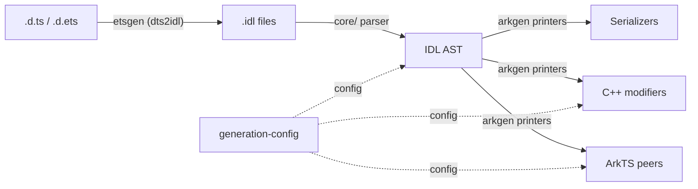
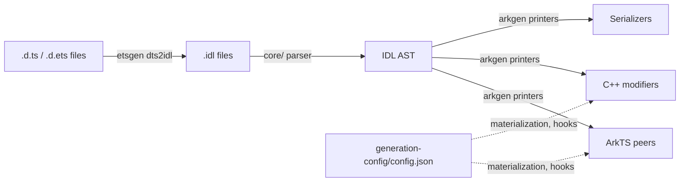
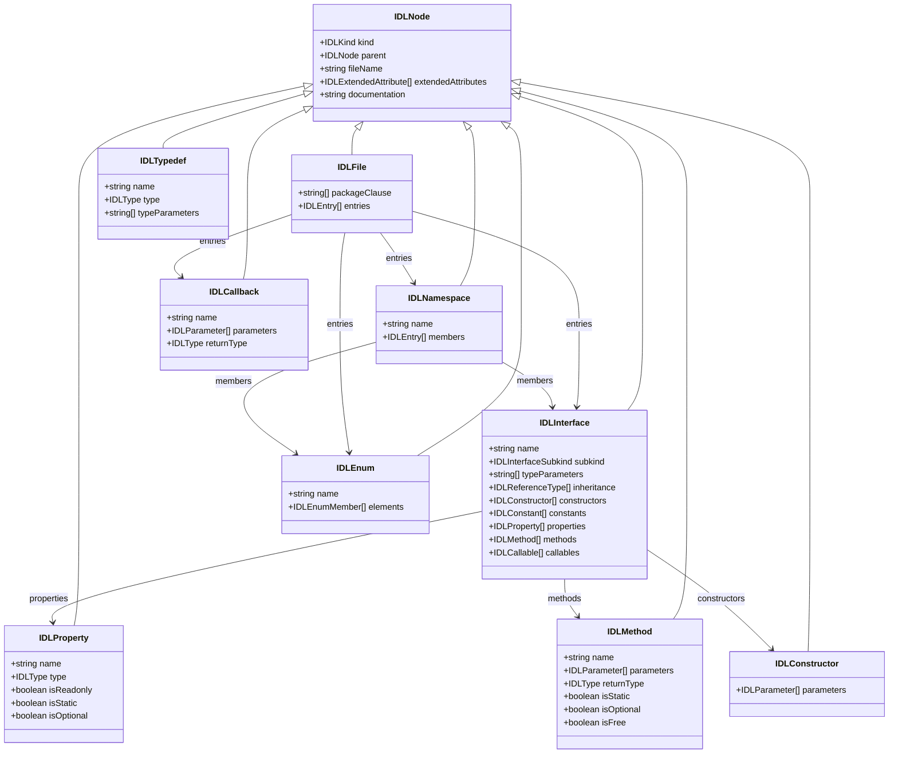
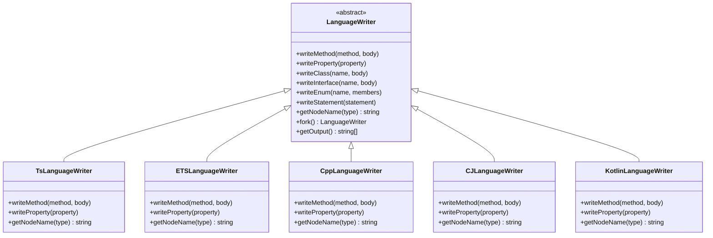
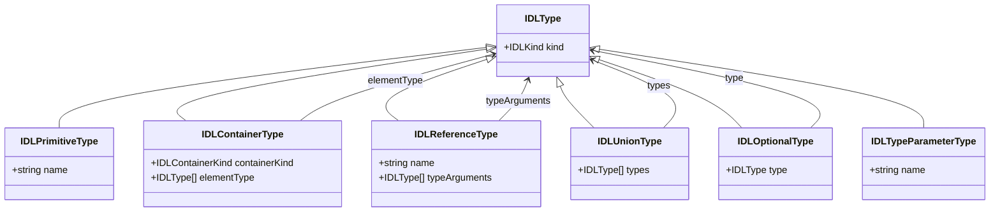

# IDLize Architecture Guide

## 1. Overview

IDLize is a compiler toolchain that ingests interface declaration files
(`.d.ts`, `.d.ets`, `.idl`) and emits native bindings for the
OpenHarmony / ArkUI ecosystem. The generated artifacts include ArkTS
peer classes, C++ libace modifiers, and serialization glue code consumed
by the Arkoala runtime.

The toolchain follows a classic compiler pipeline:
declarations are converted to an intermediate representation (IDL),
parsed into an abstract syntax tree (AST), and then walked by
language-specific printers to produce target-language output.

## 2. Basic Concepts

**peer**
A generated class that mirrors an ArkUI component's API surface. Each
peer wraps a native framenode and exposes the component's attributes and
methods to the application layer. Peers are produced by `arkgen`
printers and written in ArkTS or TypeScript.

**modifier**
A generated C++ libace object that applies property changes to a
framenode at runtime. Modifiers bridge the ArkTS peer layer and the
native ArkUI rendering engine, translating attribute setters into native
calls on the framenode.

**serializer**
Generated code that encodes property values for inter-process
communication (IPC) calls. Serializers convert typed values from IDL
representation into a wire format suitable for crossing the ArkTS/C++
boundary.

**framenode**
A native ArkUI tree node that is the runtime target of a modifier.
Each visible component in the UI tree corresponds to a framenode;
modifiers and peers operate on framenodes to update properties,
layout, and rendering state.

**materialized**
A component whose peer is fully generated from its IDL definition
rather than stubbed out. Materialization is controlled per component in
`arkgen/generation-config/config.json`. Non-materialized components
produce minimal stubs.

**hook**
A code-generation callback injected at a specific printer phase.
Hooks allow custom logic (e.g., `applyAttributesFinish`) to be
inserted during peer generation without modifying the printer itself.
Hooks are configured in `generation-config/config.json`.

**attributeDeclaration**
An IDL AST node of kind `Interface` that represents a component's
attribute API. The `ComponentsPrinter` uses `attributeDeclaration` to
look up the hook class and determine which methods to generate on the
peer. Each ArkUI component has a corresponding attribute declaration
defining its setter methods.

**interop-types**
A shared C++ type header that bridges ArkTS and C++ type definitions.
It defines the runtime type enumeration and value representations used
by both the generated peers and the native engine.

**LanguageWriter**
A language-agnostic emitter interface. `LanguageWriter` defines abstract
operations such as `writeMethod`, `writeProperty`, `writeClass`, and
`writeInterface`. Concrete subclasses (`TsLanguageWriter`,
`CppLanguageWriter`, `ETSLanguageWriter`, `CJLanguageWriter`,
`KotlinLanguageWriter`) implement these operations for their respective
target languages. Writers produce code via an `IndentedPrinter` and
track required imports automatically.

**TypeConvertor** (ArgConvertor)
A policy object that converts IDL types to target-language types and
generates the corresponding marshalling code. Each language has its own
convertor (e.g., `CppConvertor`, `ETSConvertor`, `TSConvertor`).
Convertors implement the `ArgConvertor` interface, which defines how a
parameter is converted at a call site, what runtime type tags are
emitted, and whether the conversion is scoped or array-based.

## 3. Pipeline Architecture

The end-to-end pipeline is driven by the `runner m3` command. It
proceeds through these stages:

1. **SDK preparation** -- Upstream `.d.ts` / `.d.ets` declarations are
   patched and prepared. The `runner prepareSdk` command applies patches
   from `sdk-patched/` or `sdk-patched-arkts/` to the vendored SDK
   submodule.

2. **dts2idl (etsgen)** -- The `etsgen` workspace converts TypeScript
   declaration files into `.idl` intermediate representation files.
   This stage handles TypeScript-specific constructs (unions,
   generics, conditional types) and normalizes them into the IDL
   format.

3. **Parse to AST (core)** -- The `core/` workspace reads `.idl` files
   via the `webidl2.js` parser and builds the IDL AST. The AST is the
   single source of truth for all downstream generators.

4. **Generate (arkgen / libohos)** -- Printers walk the AST and emit
   target-language code. The `arkgen` workspace produces ArkTS peers,
   C++ libace modifiers, and Arkoala bindings. The `libohos` workspace
   provides shared printer infrastructure, serializers, and language
   utilities.

5. **Install** -- Generated files are copied from the output directory
   to the target install path.

## 4. Core Modules

### 4.1 core/ -- IDL AST, Parser, and Language Abstractions

**Responsibility:** Defines the IDL AST node types, provides the
parser that reads `.idl` files into AST form, and implements the
`LanguageWriter` abstraction used by all generators.

**Key files:**

| File | Purpose |
|---|---|
| `core/src/idl/node.ts` | AST node type definitions (`IDLFile`, `IDLInterface`, `IDLMethod`, etc.) and the `IDLKind` enumeration |
| `core/src/idl/visitors.ts` | AST visitor infrastructure for walking the tree |
| `core/src/idl/builders.ts` | Factory functions for constructing AST nodes |
| `core/src/idl/utils.ts` | Utility functions for querying and manipulating IDL nodes |
| `core/src/idl/keywords.ts` | IDL keyword definitions |
| `core/src/idl/discriminators.ts` | Type guard functions (e.g., `isInterface`, `isMethod`) |
| `core/src/LanguageWriters/LanguageWriter.ts` | Abstract `LanguageWriter` base class with expression and statement IR |
| `core/src/LanguageWriters/writers/` | Concrete writer implementations (`TsLanguageWriter`, `CppLanguageWriter`, `ETSLanguageWriter`, etc.) |
| `core/src/LanguageWriters/convertors/` | Language-specific type convertors (`CppConvertor`, `ETSConvertor`, etc.) |
| `core/src/Language.ts` | `Language` class enumerating supported target languages (TS, ArkTS, C++, CangJie, Kotlin) |
| `core/src/config.ts` | Configuration loading and schema |
| `core/src/configMerge.ts` | Configuration merging logic |
| `core/src/diagnostictypes.ts` | Diagnostic and error reporting types |
| `core/src/peer-generation/` | Shared peer-generation infrastructure (`PeerLibrary`, `PeerClass`, `ReferenceResolver`, `LayoutManager`) |
| `core/src/from-idl/parser.ts` | IDL file parser that produces AST from `.idl` text |

**AST node types:**

| Node type | Kind | Description |
|---|---|---|
| `IDLFile` | `File` | Root node; contains package clause and top-level entries |
| `IDLNamespace` | `Namespace` | Named scope containing nested declarations |
| `IDLInterface` | `Interface` | Class or interface with properties, methods, constructors, and inheritance |
| `IDLEnum` | `Enum` | Enumeration with named members |
| `IDLCallback` | `Callback` | Function type signature with parameters and return type |
| `IDLTypedef` | `Typedef` | Type alias |
| `IDLImport` | `Import` | Import clause |
| `IDLProperty` | `Property` | Field or property declaration with type and modifiers |
| `IDLMethod` | `Method` | Method declaration with parameters, return type, and modifiers |
| `IDLConstructor` | `Constructor` | Constructor signature |

**Supported languages (defined in `core/src/Language.ts`):**

| Language | Extension | Notes |
|---|---|---|
| TypeScript (TS) | `.ts` | Standard TypeScript output |
| ArkTS | `.ts` | OpenHarmony TypeScript dialect |
| C++ | `.cc` | Native libace modifiers |
| CangJie | `.cj` | CangJie language target |
| Kotlin | `.kt` | Kotlin target |

**Type node types:**

| Type node | Kind | Description |
|---|---|---|
| `IDLPrimitiveType` | `PrimitiveType` | Built-in primitive (i32, f32, string, boolean, etc.) |
| `IDLContainerType` | `ContainerType` | Parameterized container (sequence, record, Promise) |
| `IDLReferenceType` | `ReferenceType` | Named type reference with optional type arguments |
| `IDLUnionType` | `UnionType` | Union of multiple types |
| `IDLTypeParameterType` | `TypeParameterType` | Generic type parameter |
| `IDLOptionalType` | `OptionalType` | Optional wrapper around another type |

### 4.2 arkgen/ -- ArkUI Component Generator

**Responsibility:** Generates ArkUI component peers, C++ libace
modifiers, and Arkoala interface bindings from the IDL AST. This is the
primary code-generation workspace.

**Key files:**

| File | Purpose |
|---|---|
| `arkgen/src/printers/ComponentsPrinter.ts` | Generates ArkUI component wrapper classes with attribute modifier support |
| `arkgen/src/printers/PeersPrinter.ts` | Generates peer classes that wrap native framenodes |
| `arkgen/src/printers/ModifierPrinter.ts` | Generates C++ libace modifier classes for attribute application |
| `arkgen/src/printers/ArkoalaInterfacePrinter.ts` | Generates Arkoala interface declarations |
| `arkgen/src/printers/StsComponentsPrinter.ts` | Generates Structured TypeScript component variants |
| `arkgen/generation-config/config.json` | Per-component configuration: materialization flags, hooks, and generation options |
| `arkgen/generation-config/schema.json` | JSON schema for the generation configuration |

**Printer architecture:**

The `arkgen` printers operate on a `PeerLibrary` object, which holds the
parsed IDL AST and all resolved references. Each printer implements a
`PrinterFunction` that takes a `PeerLibrary` and returns an array of
`PrinterResult` (generated file content and target path).

The `ComponentsPrinter` is the central printer. For each component it:
1. Collects the component's attribute declaration and its inheritance chain.
2. Resolves imports (peer classes, modifier classes, base types).
3. Emits a component class (e.g., `ArkButtonComponent`) extending the
   parent component or `ComponentBase`.
4. Generates attribute setter methods that delegate to the peer and
   modifier.
5. Applies any configured hooks at designated generation phases.

### 4.3 etsgen/ -- Declaration to IDL Transformer

**Responsibility:** Converts `.d.ts` and `.d.ets` TypeScript
declaration files into `.idl` intermediate representation files.

**Key files:**

| File | Purpose |
|---|---|
| `etsgen/src/app.ts` | Application entry point for the dts2idl conversion |
| `etsgen/src/cli.ts` | Command-line interface for the etsgen tool |
| `etsgen/src/generate.ts` | Core generation logic that transforms declarations to IDL |
| `etsgen/src/config.ts` | Configuration for the conversion process |
| `etsgen/src/utils.ts` | Utility functions for declaration processing |

The `etsgen` stage handles TypeScript-specific constructs that do not
have direct IDL equivalents: union types, intersection types, conditional
types, mapped types, and generic constraints. It normalizes these into
the simpler IDL type system while preserving semantic information
through extended attributes.

### 4.4 runner/ -- Pipeline Orchestrator

**Responsibility:** Top-level pipeline orchestrator. The `m3` command
drives the full generation flow from SDK input to generated output.
Sub-commands handle individual pipeline stages.

**Key files:**

| File | Purpose |
|---|---|
| `runner/src/main.ts` | Entry point; defines CLI commands (`m3`, `complete`, `sdk`, `m3-sdk`, `sdk-new-shape`, `transform-builder-functions`) |
| `runner/src/shared.ts` | Constants for output directories (`WORKING_DIR`, `GENERATED_IDL_DIR`, `GENERATED_PEER_DIR`, etc.) |
| `runner/src/commands/ets2idl.ts` | `ets2idl` command: invokes etsgen |
| `runner/src/commands/idl2peer.ts` | `idl2peer` command: invokes arkgen |
| `runner/src/commands/sdk.ts` | `prepareSdk` command: patches and prepares SDK |
| `runner/src/commands/scrape.ts` | `scrape` command: pulls and normalizes external SDK content |
| `runner/src/commands/install.ts` | `install` command: copies generated files to target directory |
| `runner/src/commands/absoluteSdk.ts` | Generates an absolute-path SDK from the prepared SDK |

**Output directory structure (under `runner/out/`):**

| Directory | Contents |
|---|---|
| `runner/out/idl/` | Converted `.idl` files (output of etsgen) |
| `runner/out/peers/sig/` | Generated peer code for the `sig` target |
| `runner/out/peers/libace/` | Generated peer code for the `libace` target |
| `runner/out/scraper/` | Cached external SDK content |
| `runner/out/response-files/` | Staging area for compiler response files |
| `runner/out/patched-sdk-arkts/` | Prepared ArkTS SDK declarations |
| `runner/out/patched-sdk-ts/` | Prepared TypeScript SDK declarations |

**Commands:**

- **`m3`** -- Full pipeline: SDK preparation, dts2idl, scrape, idl2peer,
  format, and install. This is the primary end-to-end command.
- **`complete`** -- Runs the ohosgen-specific pipeline (dts2idl, idl2ohos).
- **`sdk`** -- Prepares the SDK without running code generation.
- **`m3-sdk`** -- Generates an absolute-path SDK from a prepared SDK.
- **`sdk-new-shape`** -- Transforms builder functions to create a new SDK shape.
- **`transform-builder-functions`** -- Transforms component builder functions in a pre-processed SDK API directory.

### 4.5 libohos/ -- Shared Peer-Generation Infrastructure

**Responsibility:** Provides shared infrastructure used by code
generators: printers, serializers, type conversion helpers, and
language-specific utilities.

**Key files:**

| File | Purpose |
|---|---|
| `libohos/src/peer-generation/printers/` | Shared printer implementations: `SerializerPrinter`, `PeersPrinter`, `ModifierPrinter`, `CallbacksPrinter`, `StructPrinter`, etc. |
| `libohos/src/peer-generation/ComponentsCollector.ts` | Collects component declarations from the AST |
| `libohos/src/peer-generation/PeersCollector.ts` | Collects and organizes peer classes |
| `libohos/src/peer-generation/LayoutManager.ts` | Manages output file layout and path resolution |
| `libohos/src/peer-generation/NativeModule.ts` | Native module binding definitions |
| `libohos/src/peer-generation/ImportsCollector.ts` | Tracks and emits import statements |
| `libohos/src/ost/` | OST (Object Serialization Template) infrastructure |
| `libohos/src/ostgen/` | OST code generation helpers |

The `libohos` workspace acts as a shared library: `arkgen` and other
generators import its printers and utilities to avoid duplicating
generation logic. Key abstractions include `ImportsCollector` for
managing module dependencies and `LayoutManager` for determining where
generated files are placed in the output tree.

## 5. Mermaid Diagrams

### 5.1 Pipeline Data Flow

### 5.2 AST Node Hierarchy

### 5.3 LanguageWriter Hierarchy

### 5.4 Type Node Hierarchy

## 6. Data Flow

This section describes the end-to-end flow from source declarations to
generated output files.

### Stage 1: SDK Preparation

Input: vendored `interface_sdk-js/` submodule.

Process:
1. `runner prepareSdk` reads the upstream SDK submodule.
2. Patches from `sdk-patched/` or `sdk-patched-arkts/` are applied to
   fix or augment declarations.
3. An ArkTS configuration is generated (`sdk2config`).

Output:
- `runner/out/patched-sdk-arkts/` -- patched `.d.ets` files
- `runner/out/patched-sdk-ts/` -- patched `.d.ts` files

### Stage 2: dts2idl (etsgen)

Input: patched `.d.ts` / `.d.ets` files from Stage 1.

Process:
1. `etsgen` parses each declaration file using the TypeScript compiler
   API.
2. TypeScript-specific constructs are normalized into IDL equivalents.
3. One `.idl` file is produced per input declaration file.

Output:
- `runner/out/idl/` -- converted `.idl` files

### Stage 3: Scrape

Input: `.idl` files from Stage 2 plus any extra IDL paths.

Process:
1. The scraper consolidates IDL files from multiple sources.
2. Duplicate declarations are resolved.
3. A generation configuration is produced.

Output:
- `runner/out/scraper/` -- scraped and consolidated IDL files
- ArkUI configuration for downstream generation

### Stage 4: IDL to AST to Peers (arkgen)

Input: scraped `.idl` files and generation configuration.

Process:
1. `core/` parser reads each `.idl` file into an `IDLFile` AST node.
2. All AST nodes are assembled into a `PeerLibrary`, which resolves
   cross-file references and builds the inheritance graph.
3. The `ComponentsCollector` identifies which interfaces represent
   ArkUI components (via `Component` extended attribute).
4. Printers are invoked in sequence:
   - `PeersPrinter` generates native peer classes (`ArkXxxPeer`).
   - `ComponentsPrinter` generates component wrappers (`ArkXxxComponent`)
     with attribute setter methods.
   - `ModifierPrinter` generates C++ modifier classes (`XxxModifier`).
   - `ArkoalaInterfacePrinter` generates Arkoala interface files.
   - `SerializerPrinter` generates serialization code for IPC.
   - Additional printers produce build files (`.gni`, `meson.build`).

Output (under `runner/out/peers/`):

| Directory | Contents |
|---|---|
| `sig/` | TypeScript / ArkTS peer signatures and component classes |
| `libace/` | C++ libace modifiers, serializers, and native binding code |

### Stage 5: Format and Install

Input: generated files from Stage 4.

Process:
1. ArkTS output is formatted using the built-in formatter.
2. Files are copied from `runner/out/peers/{target}/` to the
   user-specified install path.

The `--target` flag controls which output subset is installed:
- `sig` -- installs only `runner/out/peers/sig/`
- `libace` -- installs only `runner/out/peers/libace/`
- `all` -- installs the entire `runner/out/peers/` directory

### Debugging the Pipeline

When a generated file appears incorrect, trace backwards through the
stages:

1. **Check generated output** in `runner/out/peers/sig/` or
   `runner/out/peers/libace/`.
2. **Check the IDL** in `runner/out/idl/` to see what the parser
   received.
3. **Check the patched SDK** in `runner/out/patched-sdk-arkts/` or
   `runner/out/patched-sdk-ts/` to see if the source declaration was
   modified.
4. **Check the generation configuration** in
   `arkgen/generation-config/config.json` to see if the component is
   materialized or has hooks applied.

Authoritative path constants live in `runner/src/shared.ts`.
