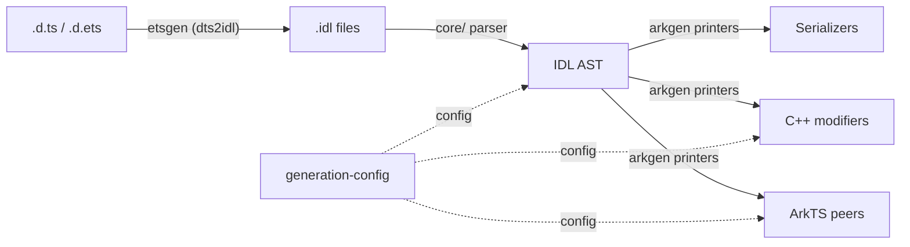
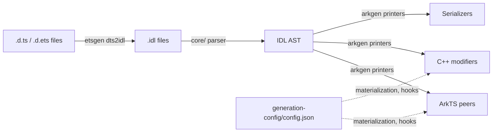
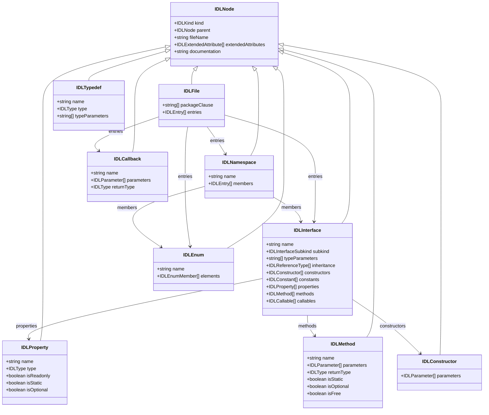
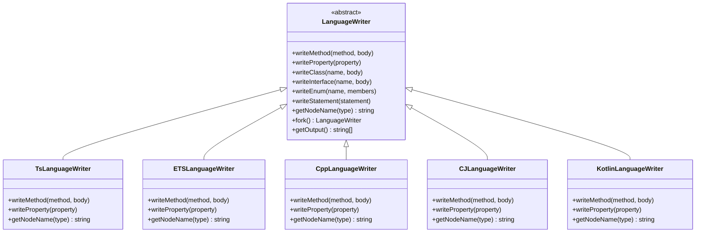
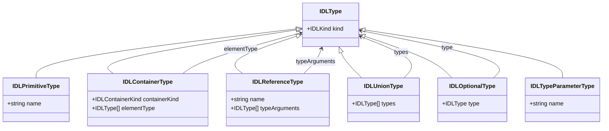

# IDLize 架构指南

## 1. 概述

IDLize 是一个编译器工具链，用于接收接口声明文件（`.d.ts`、`.d.ets`、`.idl`），
并为 OpenHarmony / ArkUI 生态系统生成原生绑定代码。生成的产物包括 ArkTS peer 类、
C++ libace modifier，以及被 Arkoala 运行时消费的序列化胶水代码。

该工具链遵循经典的编译器管线：
声明文件被转换为中间表示（IDL），解析为抽象语法树（AST），
然后由特定语言的 printer 遍历以生成目标语言输出。

## 2. 基本概念

**peer**
一个生成的类，镜像了 ArkUI 组件的 API 接口。每个 peer 封装一个原生 framenode，
并将组件的属性和方法暴露给应用层。peer 由 `arkgen` printer 生成，
使用 ArkTS 或 TypeScript 编写。

**modifier**
一个生成的 C++ libace 对象，在运行时将属性变更应用到 framenode。
Modifier 在 ArkTS peer 层和原生 ArkUI 渲染引擎之间搭建桥梁，
将属性 setter 转换为对 framenode 的原生调用。

**serializer**
生成的代码，用于为进程间通信（IPC）调用编码属性值。Serializer 将 IDL
表示中的类型值转换为适合跨越 ArkTS/C++ 边界的线路格式。

**framenode**
一个原生 ArkUI 树节点，是 modifier 的运行时目标。UI 树中的每个可见组件
都对应一个 framenode；modifier 和 peer 操作 framenode 以更新属性、布局和渲染状态。

**materialized**
一个组件，其 peer 是根据 IDL 定义完整生成的，而非 stub。
Materialization 通过 `arkgen/generation-config/config.json` 逐组件控制。
未被 materialized 的组件仅生成最小的 stub。

**hook**
在特定 printer 阶段注入的代码生成回调。hook 允许自定义逻辑
（如 `applyAttributesFinish`）在 peer 生成期间插入，而无需修改 printer 本身。
hook 在 `generation-config/config.json` 中配置。

**attributeDeclaration**
一个类型为 `Interface` 的 IDL AST 节点，表示组件的属性 API。
`ComponentsPrinter` 使用 `attributeDeclaration` 来查找 hook 类并决定在 peer 上
生成哪些方法。每个 ArkUI 组件都有一个对应的属性声明，定义其 setter 方法。

**interop-types**
一个共享的 C++ 类型头文件，桥接 ArkTS 和 C++ 类型定义。
它定义了被生成的 peer 和原生引擎共同使用的运行时类型枚举和值表示。

**LanguageWriter**
一个语言无关的发射器接口。`LanguageWriter` 定义了诸如 `writeMethod`、
`writeProperty`、`writeClass` 和 `writeInterface` 等抽象操作。
具体子类（`TsLanguageWriter`、`CppLanguageWriter`、`ETSLanguageWriter`、
`CJLanguageWriter`、`KotlinLanguageWriter`）为各自的目标语言实现这些操作。
Writer 通过 `IndentedPrinter` 生成代码，并自动跟踪所需的导入。

**TypeConvertor**（ArgConvertor）
一个策略对象，将 IDL 类型转换为目标语言类型并生成相应的编组代码。
每种语言都有自己的转换器（如 `CppConvertor`、`ETSConvertor`、`TSConvertor`）。
转换器实现 `ArgConvertor` 接口，该接口定义了参数在调用处如何转换、
发出什么运行时类型标签，以及转换是基于作用域还是基于数组。

## 3. 管线架构

端到端管线由 `runner m3` 命令驱动。它按以下阶段执行：

1. **SDK 准备** -- 上游 `.d.ts` / `.d.ets` 声明被打补丁并准备就绪。
   `runner prepareSdk` 命令将 `sdk-patched/` 或 `sdk-patched-arkts/` 中的补丁
   应用于 vendored 的 SDK 子模块。

2. **dts2idl（etsgen）** -- `etsgen` 工作区将 TypeScript 声明文件转换为 `.idl`
   中间表示文件。此阶段处理 TypeScript 特有的构造（联合类型、泛型、条件类型）
   并将其规范化为 IDL 格式。

3. **解析为 AST（core）** -- `core/` 工作区通过 `webidl2.js` 解析器读取 `.idl`
   文件并构建 IDL AST。AST 是所有下游生成器的唯一事实来源。

4. **生成（arkgen / libohos）** -- Printer 遍历 AST 并发射目标语言代码。
   `arkgen` 工作区生成 ArkTS peer、C++ libace modifier 和 Arkoala 绑定。
   `libohos` 工作区提供共享的 printer 基础设施、serializer 和语言工具。

5. **安装** -- 生成的文件从输出目录复制到目标安装路径。

## 4. 核心模块

### 4.1 core/ -- IDL AST、解析器和语言抽象

**职责：** 定义 IDL AST 节点类型，提供将 `.idl` 文件读入 AST 形式的解析器，
以及实现所有生成器使用的 `LanguageWriter` 抽象。

**关键文件：**

| 文件 | 用途 |
|---|---|
| `core/src/idl/node.ts` | AST 节点类型定义（`IDLFile`、`IDLInterface`、`IDLMethod` 等）和 `IDLKind` 枚举 |
| `core/src/idl/visitors.ts` | 用于遍历树的 AST 访问器基础设施 |
| `core/src/idl/builders.ts` | 构造 AST 节点的工厂函数 |
| `core/src/idl/utils.ts` | 查询和操作 IDL 节点的工具函数 |
| `core/src/idl/keywords.ts` | IDL 关键字定义 |
| `core/src/idl/discriminators.ts` | 类型守卫函数（如 `isInterface`、`isMethod`） |
| `core/src/LanguageWriters/LanguageWriter.ts` | 抽象 `LanguageWriter` 基类，包含表达式和语句 IR |
| `core/src/LanguageWriters/writers/` | 具体 writer 实现（`TsLanguageWriter`、`CppLanguageWriter`、`ETSLanguageWriter` 等） |
| `core/src/LanguageWriters/convertors/` | 语言特定的类型转换器（`CppConvertor`、`ETSConvertor` 等） |
| `core/src/Language.ts` | `Language` 类，枚举支持的目标语言（TS、ArkTS、C++、CangJie、Kotlin） |
| `core/src/config.ts` | 配置加载和模式 |
| `core/src/configMerge.ts` | 配置合并逻辑 |
| `core/src/diagnostictypes.ts` | 诊断和错误报告类型 |
| `core/src/peer-generation/` | 共享的 peer 生成基础设施（`PeerLibrary`、`PeerClass`、`ReferenceResolver`、`LayoutManager`） |
| `core/src/from-idl/parser.ts` | IDL 文件解析器，从 `.idl` 文本生成 AST |

**AST 节点类型：**

| 节点类型 | Kind | 描述 |
|---|---|---|
| `IDLFile` | `File` | 根节点；包含 package 子句和顶层条目 |
| `IDLNamespace` | `Namespace` | 命名作用域，包含嵌套声明 |
| `IDLInterface` | `Interface` | 类或接口，包含属性、方法、构造函数和继承关系 |
| `IDLEnum` | `Enum` | 带有命名成员的枚举 |
| `IDLCallback` | `Callback` | 函数类型签名，包含参数和返回类型 |
| `IDLTypedef` | `Typedef` | 类型别名 |
| `IDLImport` | `Import` | 导入子句 |
| `IDLProperty` | `Property` | 带类型和修饰符的字段或属性声明 |
| `IDLMethod` | `Method` | 带参数、返回类型和修饰符的方法声明 |
| `IDLConstructor` | `Constructor` | 构造函数签名 |

**支持的语言（定义在 `core/src/Language.ts`）：**

| 语言 | 扩展名 | 备注 |
|---|---|---|
| TypeScript (TS) | `.ts` | 标准 TypeScript 输出 |
| ArkTS | `.ts` | OpenHarmony TypeScript 方言 |
| C++ | `.cc` | 原生 libace modifier |
| CangJie | `.cj` | CangJie 语言目标 |
| Kotlin | `.kt` | Kotlin 目标 |

**类型节点：**

| 类型节点 | Kind | 描述 |
|---|---|---|
| `IDLPrimitiveType` | `PrimitiveType` | 内置原语（i32、f32、string、boolean 等） |
| `IDLContainerType` | `ContainerType` | 参数化容器（sequence、record、Promise） |
| `IDLReferenceType` | `ReferenceType` | 带可选类型参数的命名类型引用 |
| `IDLUnionType` | `UnionType` | 多种类型的联合 |
| `IDLTypeParameterType` | `TypeParameterType` | 泛型类型参数 |
| `IDLOptionalType` | `OptionalType` | 围绕另一种类型的可选包装 |

### 4.2 arkgen/ -- ArkUI 组件生成器

**职责：** 从 IDL AST 生成 ArkUI 组件 peer、C++ libace modifier
和 Arkoala 接口绑定。这是主要的代码生成工作区。

**关键文件：**

| 文件 | 用途 |
|---|---|
| `arkgen/src/printers/ComponentsPrinter.ts` | 生成带有属性 modifier 支持的 ArkUI 组件包装类 |
| `arkgen/src/printers/PeersPrinter.ts` | 生成封装原生 framenode 的 peer 类 |
| `arkgen/src/printers/ModifierPrinter.ts` | 生成用于属性应用的 C++ libace modifier 类 |
| `arkgen/src/printers/ArkoalaInterfacePrinter.ts` | 生成 Arkoala 接口声明 |
| `arkgen/src/printers/StsComponentsPrinter.ts` | 生成结构化 TypeScript 组件变体 |
| `arkgen/generation-config/config.json` | 逐组件配置：materialization 标志、hook 和生成选项 |
| `arkgen/generation-config/schema.json` | 生成配置的 JSON 模式 |

**Printer 架构：**

`arkgen` printer 操作 `PeerLibrary` 对象，该对象持有解析后的 IDL AST
和所有已解析的引用。每个 printer 实现一个 `PrinterFunction`，
接收 `PeerLibrary` 并返回 `PrinterResult` 数组（生成的文件内容和目标路径）。

`ComponentsPrinter` 是核心 printer。对于每个组件，它：
1. 收集组件的属性声明及其继承链。
2. 解析导入（peer 类、modifier 类、基类型）。
3. 发射一个组件类（如 `ArkButtonComponent`），继承父组件或 `ComponentBase`。
4. 生成属性 setter 方法，委托给 peer 和 modifier。
5. 在指定的生成阶段应用配置的 hook。

### 4.3 etsgen/ -- 声明到 IDL 转换器

**职责：** 将 `.d.ts` 和 `.d.ets` TypeScript 声明文件转换为 `.idl` 中间表示文件。

**关键文件：**

| 文件 | 用途 |
|---|---|
| `etsgen/src/app.ts` | dts2idl 转换的应用入口 |
| `etsgen/src/cli.ts` | etsgen 工具的命令行接口 |
| `etsgen/src/generate.ts` | 将声明转换为 IDL 的核心生成逻辑 |
| `etsgen/src/config.ts` | 转换过程的配置 |
| `etsgen/src/utils.ts` | 声明处理的工具函数 |

`etsgen` 阶段处理没有直接 IDL 等价物的 TypeScript 特有构造：联合类型、
交叉类型、条件类型、映射类型和泛型约束。它将这些规范化为更简单的 IDL
类型系统，同时通过扩展属性保留语义信息。

### 4.4 runner/ -- 管线编排器

**职责：** 顶层管线编排器。`m3` 命令驱动从 SDK 输入到生成输出的完整生成流程。
子命令处理各个管线阶段。

**关键文件：**

| 文件 | 用途 |
|---|---|
| `runner/src/main.ts` | 入口；定义 CLI 命令（`m3`、`complete`、`sdk`、`m3-sdk`、`sdk-new-shape`、`transform-builder-functions`） |
| `runner/src/shared.ts` | 输出目录常量（`WORKING_DIR`、`GENERATED_IDL_DIR`、`GENERATED_PEER_DIR` 等） |
| `runner/src/commands/ets2idl.ts` | `ets2idl` 命令：调用 etsgen |
| `runner/src/commands/idl2peer.ts` | `idl2peer` 命令：调用 arkgen |
| `runner/src/commands/sdk.ts` | `prepareSdk` 命令：打补丁并准备 SDK |
| `runner/src/commands/scrape.ts` | `scrape` 命令：拉取并规范化外部 SDK 内容 |
| `runner/src/commands/install.ts` | `install` 命令：将生成的文件复制到目标目录 |
| `runner/src/commands/absoluteSdk.ts` | 从已准备的 SDK 生成绝对路径 SDK |

**输出目录结构（在 `runner/out/` 下）：**

| 目录 | 内容 |
|---|---|
| `runner/out/idl/` | 转换后的 `.idl` 文件（etsgen 的输出） |
| `runner/out/peers/sig/` | `sig` 目标的生成 peer 代码 |
| `runner/out/peers/libace/` | `libace` 目标的生成 peer 代码 |
| `runner/out/scraper/` | 缓存的外部 SDK 内容 |
| `runner/out/response-files/` | 编译器响应文件的暂存区 |
| `runner/out/patched-sdk-arkts/` | 已准备的 ArkTS SDK 声明 |
| `runner/out/patched-sdk-ts/` | 已准备的 TypeScript SDK 声明 |

**命令：**

- **`m3`** -- 完整管线：SDK 准备、dts2idl、scrape、idl2peer、格式化和安装。
  这是主要的端到端命令。
- **`complete`** -- 运行 ohosgen 特定的管线（dts2idl、idl2ohos）。
- **`sdk`** -- 准备 SDK 而不运行代码生成。
- **`m3-sdk`** -- 从已准备的 SDK 生成绝对路径 SDK。
- **`sdk-new-shape`** -- 转换 builder 函数以创建新的 SDK 形态。
- **`transform-builder-functions`** -- 在预处理后的 SDK API 目录中转换组件 builder 函数。

### 4.5 libohos/ -- 共享 Peer 生成基础设施

**职责：** 提供代码生成器使用的共享基础设施：printer、serializer、
类型转换辅助工具和语言特定工具。

**关键文件：**

| 文件 | 用途 |
|---|---|
| `libohos/src/peer-generation/printers/` | 共享 printer 实现：`SerializerPrinter`、`PeersPrinter`、`ModifierPrinter`、`CallbacksPrinter`、`StructPrinter` 等 |
| `libohos/src/peer-generation/ComponentsCollector.ts` | 从 AST 中收集组件声明 |
| `libohos/src/peer-generation/PeersCollector.ts` | 收集和组织 peer 类 |
| `libohos/src/peer-generation/LayoutManager.ts` | 管理输出文件布局和路径解析 |
| `libohos/src/peer-generation/NativeModule.ts` | 原生模块绑定定义 |
| `libohos/src/peer-generation/ImportsCollector.ts` | 跟踪和发射导入语句 |
| `libohos/src/ost/` | OST（对象序列化模板）基础设施 |
| `libohos/src/ostgen/` | OST 代码生成辅助工具 |

`libohos` 工作区作为共享库：`arkgen` 和其他生成器导入其 printer 和工具，
以避免重复生成逻辑。关键抽象包括用于管理模块依赖的 `ImportsCollector`
和用于确定生成文件在输出树中放置位置的 `LayoutManager`。

## 5. Mermaid 图

### 5.1 管线数据流

### 5.2 AST 节点层次结构

### 5.3 LanguageWriter 层次结构

### 5.4 类型节点层次结构

## 6. 数据流

本节描述从源声明到生成输出文件的端到端流程。

### 阶段 1：SDK 准备

输入：vendored 的 `interface_sdk-js/` 子模块。

过程：
1. `runner prepareSdk` 读取上游 SDK 子模块。
2. 应用 `sdk-patched/` 或 `sdk-patched-arkts/` 中的补丁以修复或增强声明。
3. 生成 ArkTS 配置（`sdk2config`）。

输出：
- `runner/out/patched-sdk-arkts/` -- 已打补丁的 `.d.ets` 文件
- `runner/out/patched-sdk-ts/` -- 已打补丁的 `.d.ts` 文件

### 阶段 2：dts2idl（etsgen）

输入：来自阶段 1 的已打补丁 `.d.ts` / `.d.ets` 文件。

过程：
1. `etsgen` 使用 TypeScript 编译器 API 解析每个声明文件。
2. TypeScript 特有的构造被规范化为 IDL 等价物。
3. 每个输入声明文件生成一个 `.idl` 文件。

输出：
- `runner/out/idl/` -- 转换后的 `.idl` 文件

### 阶段 3：Scrape

输入：来自阶段 2 的 `.idl` 文件以及任何额外 IDL 路径。

过程：
1. Scraper 合并来自多个来源的 IDL 文件。
2. 解决重复声明。
3. 生成配置。

输出：
- `runner/out/scraper/` -- 抓取并合并后的 IDL 文件
- 用于下游生成的 ArkUI 配置

### 阶段 4：IDL 到 AST 到 Peer（arkgen）

输入：抓取的 `.idl` 文件和生成配置。

过程：
1. `core/` 解析器将每个 `.idl` 文件读入 `IDLFile` AST 节点。
2. 所有 AST 节点组装到 `PeerLibrary` 中，解析跨文件引用并构建继承图。
3. `ComponentsCollector` 识别哪些接口代表 ArkUI 组件（通过 `Component`
   扩展属性）。
4. Printer 按顺序调用：
   - `PeersPrinter` 生成原生 peer 类（`ArkXxxPeer`）。
   - `ComponentsPrinter` 生成带有属性 setter 方法的组件包装（`ArkXxxComponent`）。
   - `ModifierPrinter` 生成 C++ modifier 类（`XxxModifier`）。
   - `ArkoalaInterfacePrinter` 生成 Arkoala 接口文件。
   - `SerializerPrinter` 生成 IPC 的序列化代码。
   - 附加的 printer 生成构建文件（`.gni`、`meson.build`）。

输出（在 `runner/out/peers/` 下）：

| 目录 | 内容 |
|---|---|
| `sig/` | TypeScript / ArkTS peer 签名和组件类 |
| `libace/` | C++ libace modifier、serializer 和原生绑定代码 |

### 阶段 5：格式化和安装

输入：来自阶段 4 的生成文件。

过程：
1. ArkTS 输出使用内置格式化器进行格式化。
2. 文件从 `runner/out/peers/{target}/` 复制到用户指定的安装路径。

`--target` 标志控制安装哪个输出子集：
- `sig` -- 仅安装 `runner/out/peers/sig/`
- `libace` -- 仅安装 `runner/out/peers/libace/`
- `all` -- 安装整个 `runner/out/peers/` 目录

### 调试管线

当生成的文件出现问题时，请沿阶段向前回溯排查：

1. **检查生成输出**，在 `runner/out/peers/sig/` 或 `runner/out/peers/libace/`。
2. **检查 IDL**，在 `runner/out/idl/` 中查看解析器接收到的内容。
3. **检查已打补丁的 SDK**，在 `runner/out/patched-sdk-arkts/` 或
   `runner/out/patched-sdk-ts/` 中查看源声明是否被修改。
4. **检查生成配置**，在 `arkgen/generation-config/config.json` 中查看组件
   是否被 materialized 或有 hook 被应用。

权威路径常量定义在 `runner/src/shared.ts` 中。
