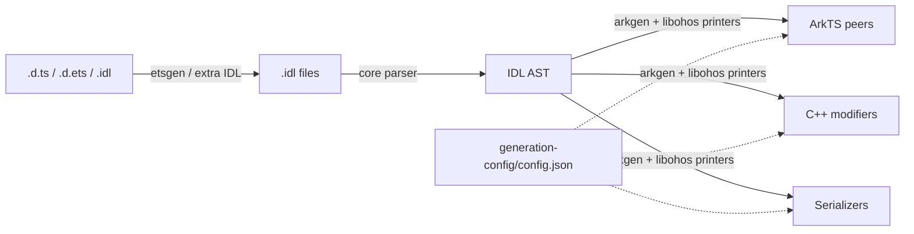
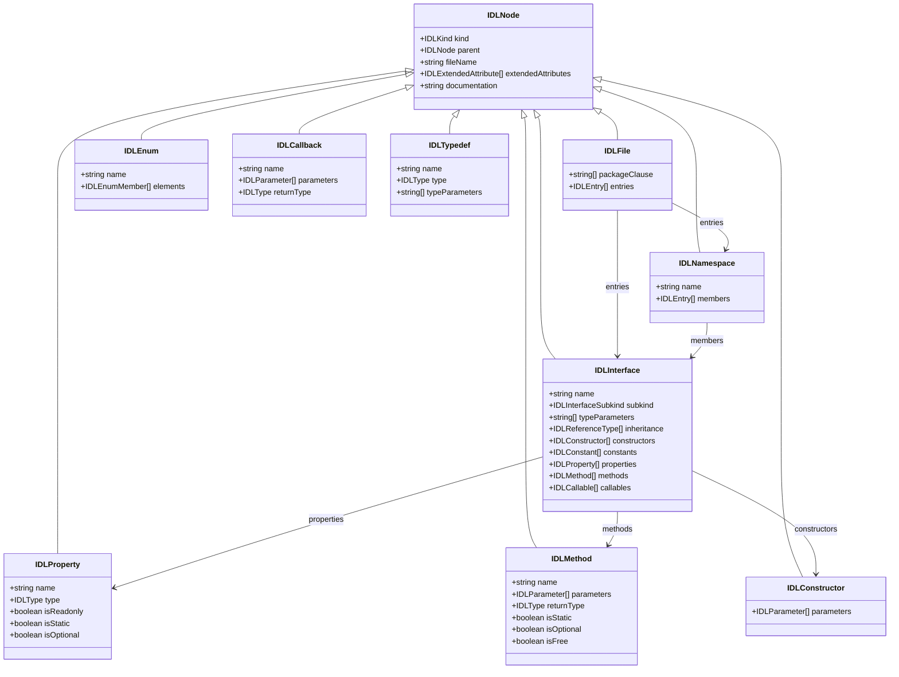
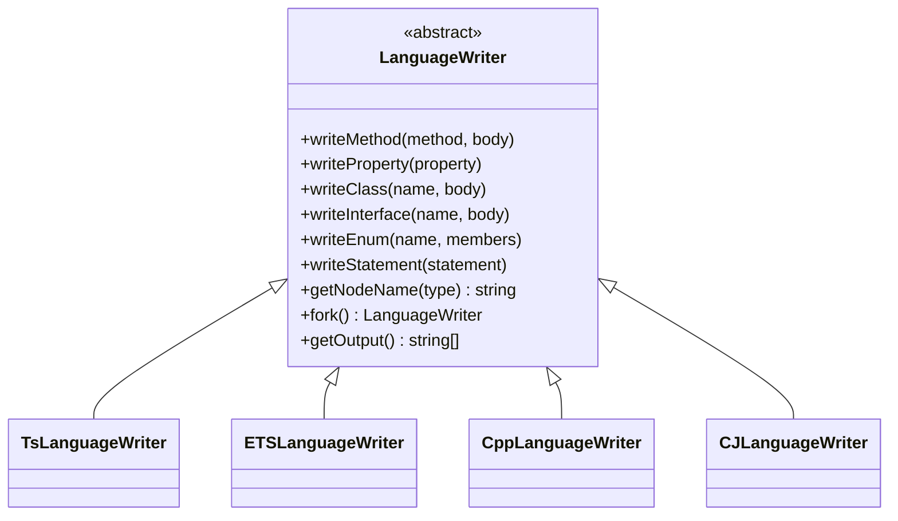
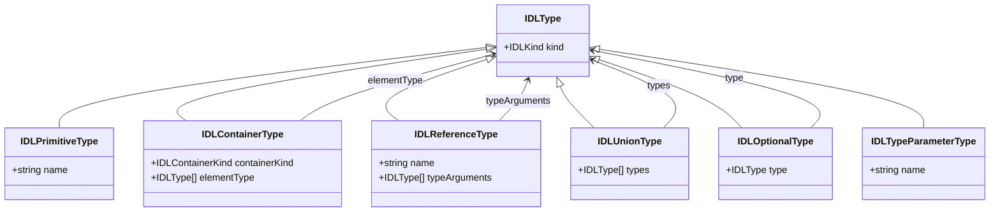

# IDLize Architecture Design

## 1. Overview

IDLize is a compile-time generator tool for OpenHarmony ArkUI. It reads
interface declaration files (`.d.ets`, `.idl`, and `.d.ts` still supported by
the pipeline), converts declarations to the IDL intermediate representation,
parses them into an abstract syntax tree (AST), then emits ArkTS-layer classes,
C++-layer Modifiers, Serializers, and Arkoala glue code.

The main data flow is:

```text
declarations -> IDL -> parser -> AST -> printers -> generated code
```

`runner m3` drives the end-to-end flow. `core/`, `etsgen/`, `arkgen/`,
`libohos/`, and `runner/` own different stages.

## 2. Basic Concepts

**FrameNode**
An ArkUI C++-layer component node representing one component instance in the UI
tree. It stores state required for properties, layout, and rendering, and is the
runtime target of C++ Modifiers.

**Peer**
An ArkTS-layer class generated by IDLize that mirrors an ArkUI component API. A
Peer exposes component attributes and methods, then forwards calls to the C++
layer.

**Modifier**
A C++-layer struct / object generated by IDLize to apply property changes to the
corresponding FrameNode.

**Serializer**
Generated encode/decode logic used for type conversion, callback transfer, and
parameter marshalling between ArkTS and C++.

**Arkoala**
The multi-language ArkUI runtime project that consumes Peer interfaces, language
bindings, and serialization glue generated by IDLize.

**materialized**
A component or interface that is fully generated instead of represented by a
minimal stub. Materialization is mainly controlled by
`arkgen/generation-config/config.json`.

**hook**
A configuration mechanism for injecting custom logic at a specified generation
phase. For example, a hook can insert extra code after component attribute
application without rewriting the whole printer.

**attributeDeclaration**
An IDL `Interface` node representing a component's attribute API. The
`ComponentsPrinter` uses it to collect setters, look up hooks, and decide which
methods to generate on the component class.

**interop-types**
A shared ArkTS/C++ C++ type header. It defines runtime type enumerations and
value representations used by both generated code and the native side.

**LanguageWriter**
A target-language-neutral code writing abstraction. TS, ArkTS, C++, Cangjie, and
other writers implement the same writing interface so higher-level generation
logic can emit different languages uniformly.

**TypeConvertor / ArgConvertor**
A policy object that converts IDL types to target-language types and runtime
marshalling code. When adding cross-language types, confirm that each language
convertor and Serializer stay aligned.

## 3. Pipeline Architecture



1. **SDK preparation**: `runner sdk` or `runner m3 --sdk-stage original` prepares
   an SDK from `interface_sdk-js/` and applies patches from `sdk-patched/` and
   `sdk-patched-arkts/`.
2. **ETS / DTS to IDL**: `etsgen` converts `.d.ets` / `.d.ts` declarations to `.idl`.
3. **IDL parsing to AST**: `core` parses `.idl` and builds the AST shared by downstream generators.
4. **Generation**: `arkgen` and `libohos` walk the AST and emit ArkTS Peers, C++
   Modifiers, Serializers, and Arkoala glue code.
5. **Installation**: `runner` installs selected targets into the `--output` directory.

## 4. Workspace Responsibilities

### 4.1 `core/`: IDL AST, Parser, and Language Abstractions

`core/` is the shared foundation for all generators. It defines the AST, parses
IDL, and provides writer and type-conversion abstractions.

| File or directory | Purpose |
|---|---|
| `core/src/from-idl/parser.ts` | Parses `.idl` text into AST. |
| `core/src/idl/node.ts` | Defines AST nodes, extended attributes, and `IDLKind`. |
| `core/src/idl/builders.ts` | Factory functions for AST nodes. |
| `core/src/idl/discriminators.ts` | AST type guards. |
| `core/src/idl/utils.ts` | AST query and helper operations. |
| `core/src/LanguageWriters/LanguageWriter.ts` | Target-language-neutral writing abstraction. |
| `core/src/LanguageWriters/writers/` | Writers for TS, ArkTS, C++, CangJie, and more target languages. |
| `core/src/LanguageWriters/convertors/` | Converters from IDL types to target-language types. |
| `core/src/peer-generation/` | Shared peer model, reference resolution, and layout infrastructure. |

Common AST nodes:

| Node | Description |
|---|---|
| `IDLFile` | Root node containing package and top-level declarations. |
| `IDLNamespace` | Named scope. |
| `IDLInterface` | Interface or class-shaped declaration with attributes, methods, constructors, and inheritance. |
| `IDLEnum` | Enumeration. |
| `IDLCallback` | Callback function type. |
| `IDLTypedef` | Type alias. |
| `IDLProperty` | Attribute or field. |
| `IDLMethod` | Method. |
| `IDLConstructor` | Constructor. |

### 4.2 `etsgen/`: Declaration to IDL Conversion

`etsgen/` normalizes TypeScript / ArkTS declarations into IDL. It handles unions,
generics, optional parameters, conditional types, and other constructs that must
be simplified or preserved as metadata in IDL.

| File | Purpose |
|---|---|
| `etsgen/src/app.ts` | dts2idl conversion entry point. |
| `etsgen/src/cli.ts` | CLI option handling. |
| `etsgen/src/generate.ts` | Core declaration-to-IDL conversion logic. |
| `etsgen/src/config.ts` | Conversion configuration loading. |
| `etsgen/generator-config.json` | Conversion configuration used by the standard pipeline. |

If IDL in `runner/out/idl/` is already wrong, check `etsgen` and SDK patches
before patching output in `arkgen`.

### 4.3 `arkgen/`: ArkUI Component Generation

`arkgen/` is the main ArkUI code generation workspace. It generates ArkTS Peer /
Component code, C++ Modifiers, and Arkoala interfaces from the IDL AST.

| File | Purpose |
|---|---|
| `arkgen/src/app.ts` | CLI entry point that loads IDL and generation configuration. |
| `arkgen/src/arkoala.ts` | Orchestrates Arkoala and libace outputs. |
| `arkgen/src/ArkoalaPeerLibrary.ts` | PeerLibrary used by ArkUI generation. |
| `arkgen/src/printers/ComponentsPrinter.ts` | Generates component classes and attribute setters. |
| `arkgen/src/printers/PeersPrinter.ts` | Generates Peer classes. |
| `arkgen/src/printers/ModifierPrinter.ts` | Generates C++ Modifiers. |
| `arkgen/src/printers/ArkoalaInterfacePrinter.ts` | Generates Arkoala interface declarations. |
| `arkgen/generation-config/config.json` | Component materialization, hooks, and generation options. |
| `arkgen/generation-config/schema.json` | Generation configuration schema. |

Core `ComponentsPrinter` flow:

1. Collect the component's `attributeDeclaration` and inheritance chain.
2. Resolve Peer, Modifier, base class, and IDL type references.
3. Emit the `ArkXxxComponent` class.
4. Generate attribute setters and delegate to Peer / Modifier.
5. Apply hooks at configured phases.

### 4.4 `libohos/`: Shared Generation Infrastructure

`libohos/` provides printers, collectors, Serializers, and language utilities
shared across generators.

| File or directory | Purpose |
|---|---|
| `libohos/src/peer-generation/printers/` | Shared printers, including Serializer, Peer, Modifier, Callback, and Struct printers. |
| `libohos/src/peer-generation/ComponentsCollector.ts` | Collects component declarations from the AST. |
| `libohos/src/peer-generation/PeersCollector.ts` | Collects and organizes Peer classes. |
| `libohos/src/peer-generation/ImportsCollector.ts` | Tracks and emits imports. |
| `libohos/src/peer-generation/LayoutManager.ts` | Manages output file layout. |
| `libohos/src/peer-generation/NativeModule.ts` | Describes native module bindings. |
| `libohos/src/ost/`, `libohos/src/ostgen/` | Object serialization template and generation helpers. |

When both ArkTS and C++ sides show similar issues, first decide whether the fix
belongs in shared `libohos` logic.

### 4.5 `runner/`: Pipeline Orchestration

`runner/` provides the top-level CLI and connects SDK preparation, IDL
conversion, scrape, code generation, formatting, and installation.

| File | Purpose |
|---|---|
| `runner/src/main.ts` | Defines `m3`, `complete`, `sdk`, `m3-sdk`, and related commands. |
| `runner/src/shared.ts` | Defines output path constants under `runner/out`. |
| `runner/src/commands/ets2idl.ts` | Invokes `etsgen`. |
| `runner/src/commands/idl2peer.ts` | Invokes `arkgen`. |
| `runner/src/commands/sdk.ts` | Prepares patched SDKs. |
| `runner/src/commands/scrape.ts` | Merges and normalizes IDL input. |
| `runner/src/commands/install.ts` | Installs generated output. |
| `runner/src/tools/formatArkts.ts` | Formats ArkTS output. |

## 5. `runner/out` Data Flow

`runner/src/shared.ts` centralizes output path definitions. A standard generation
run writes these primary directories:

| Directory | Contents |
|---|---|
| `runner/out/idl/` | `.idl` files converted by `etsgen`. |
| `runner/out/scraper/` | IDL merged and processed by the scraper. |
| `runner/out/peers/sig/` | ArkTS / TypeScript output generated for the `sig` target. |
| `runner/out/peers/libace/` | C++ output generated for the `libace` target. |
| `runner/out/patched-sdk-arkts/` | Prepared ArkTS SDK declarations. |
| `runner/out/patched-sdk-ts/` | Prepared TypeScript SDK declarations. |
| `runner/out/response-files/` | Staging area for compiler response files. |

`--target` controls what is installed into `--output`:

| `--target` | Installed content |
|---|---|
| `sig` | Installs only `runner/out/peers/sig/`. |
| `libace` | Installs only `runner/out/peers/libace/`. |
| `all` | Installs all of `runner/out/peers/`, usually producing `out/sig/` and `out/libace/`. |

## 6. Debugging Path

When generated files are wrong, do not infer the cause from final output only.
Trace backwards through the pipeline:

1. **Final installed artifacts**: inspect `out/` for missing files or wrong API shape.
2. **Printer output**: inspect `runner/out/peers/sig/` and `runner/out/peers/libace/`.
3. **IDL input**: inspect `runner/out/idl/` for missing attributes, methods, or type information.
4. **Prepared SDK**: inspect `runner/out/patched-sdk-arkts/` and `runner/out/patched-sdk-ts/`.
5. **Source patches**: inspect `sdk-patched-arkts/`, `sdk-patched/`, or handwritten IDL.
6. **Generation configuration**: inspect `arkgen/generation-config/config.json` for materialization,
   hooks, or type-conversion settings.

This order avoids fixing input problems in printers and avoids confusing install
stage problems with generator problems.

## 7. Mermaid Diagrams

### 7.1 AST Node Relationships



### 7.2 LanguageWriter Relationships



### 7.3 Type Node Relationships


