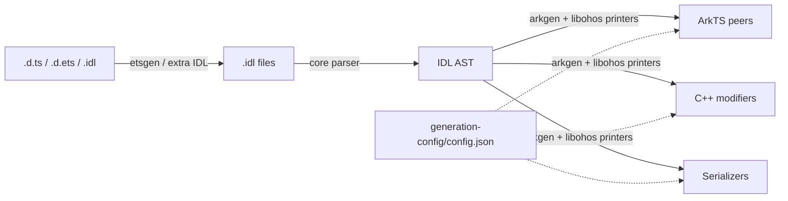
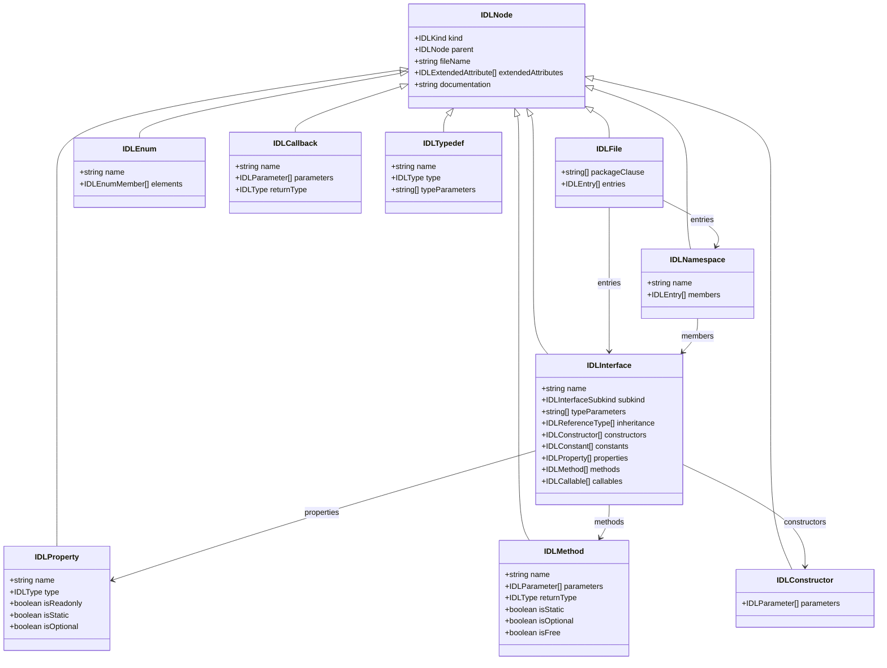
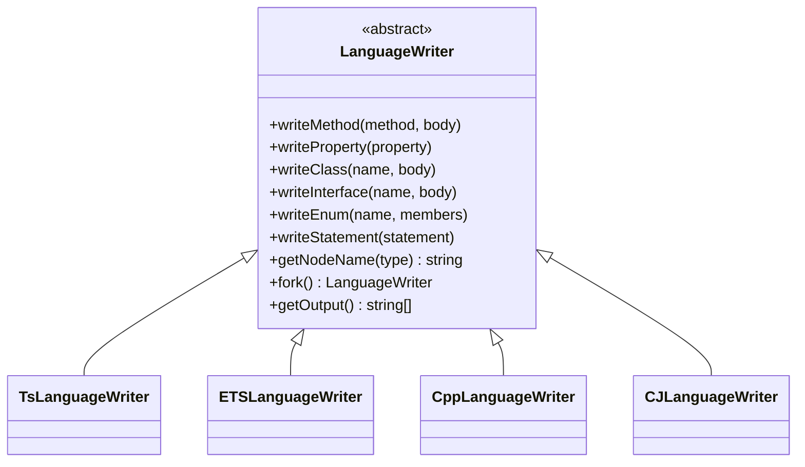
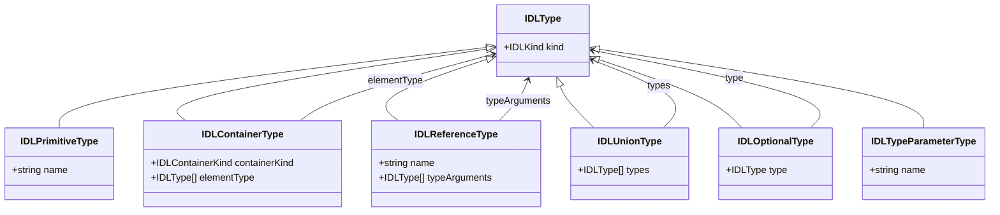

# IDLize 架构设计

## 1. 概述

IDLize 是面向 OpenHarmony ArkUI 的编译期生成器工具。它读取接口声明文件
（`.d.ets`、`.idl`，以及管线兼容的 `.d.ts`），将声明转换为 IDL 中间表示，解析为
抽象语法树（AST），再由生成器输出 ArkTS 层类、C++ 层 Modifier、Serializer 和
Arkoala 胶水代码。

主线数据流是：

```text
declarations -> IDL -> parser -> AST -> printers -> generated code
```

`runner m3` 驱动端到端流程；`core/`、`etsgen/`、`arkgen/`、`libohos/` 和
`runner/` 分别负责不同阶段。

## 2. 基本概念

**FrameNode**
ArkUI C++ 层组件节点，表示 UI 树中的一个组件实例。它保存属性、布局和渲染所需的
状态，是 C++ Modifier 最终操作的目标。

**Peer**
IDLize 生成的 ArkTS 层类，镜像 ArkUI 组件 API。Peer 暴露组件属性和方法，并将调用
转发到 C++ 层。

**Modifier**
IDLize 生成的 C++ 层 struct / 对象，用于把属性变化应用到对应 FrameNode。

**Serializer**
IDLize 生成的编码/解码逻辑，用于 ArkTS 和 C++ 之间的类型转换、回调传递和参数封送。

**Arkoala**
多语言 ArkUI 运行时项目，消费 IDLize 生成的 Peer 接口、语言绑定和序列化胶水代码。

**materialized**
组件或接口被完整生成，而不是只生成最小 stub。Materialization 主要由
`arkgen/generation-config/config.json` 控制。

**hook**
在指定生成阶段注入定制逻辑的配置机制。例如在组件属性应用结束时插入额外代码，而
不必重写整个 printer。

**attributeDeclaration**
表示组件属性 API 的 IDL `Interface` 节点。`ComponentsPrinter` 依赖它收集 setter、
查找 hook，并决定组件类上生成哪些方法。

**interop-types**
ArkTS/C++ 之间共享的 C++ 类型头文件，定义生成代码和 native 侧共同使用的运行时类型
枚举和值表示。

**LanguageWriter**
目标语言无关的代码写入抽象。TS、ArkTS、C++、Cangjie 等 writer 实现相同的写入接口，
让上层生成逻辑可以以统一方式输出不同语言。

**TypeConvertor / ArgConvertor**
将 IDL 类型转换为目标语言类型和运行时封送代码的策略对象。新增跨语言类型时，需要
确认各语言 convertor 与 Serializer 一致。

## 3. 管线架构



1. **SDK 准备**：`runner sdk` 或 `runner m3 --sdk-stage original` 从
   `interface_sdk-js/` 准备 SDK，并应用 `sdk-patched/`、`sdk-patched-arkts/` 中的补丁。
2. **ETS / DTS 到 IDL**：`etsgen` 将 `.d.ets` / `.d.ts` 声明转换为 `.idl`。
3. **IDL 解析为 AST**：`core` 解析 `.idl`，构建下游生成器共享的 AST。
4. **生成**：`arkgen` 和 `libohos` 遍历 AST，输出 ArkTS Peer、C++ Modifier、
   Serializer 和 Arkoala 胶水代码。
5. **安装**：`runner` 将选定目标安装到 `--output` 目录。

## 4. Workspace 职责

### 4.1 `core/`：IDL AST、Parser 和语言抽象

`core/` 是所有生成器共享的基础层。它负责定义 AST、解析 IDL、提供 writer 和类型转换
抽象。

| 文件或目录 | 用途 |
|---|---|
| `core/src/from-idl/parser.ts` | 将 `.idl` 文本解析为 AST。 |
| `core/src/idl/node.ts` | AST 节点、扩展属性和 `IDLKind` 定义。 |
| `core/src/idl/builders.ts` | AST 节点构造函数。 |
| `core/src/idl/discriminators.ts` | AST 类型守卫。 |
| `core/src/idl/utils.ts` | AST 查询和辅助操作。 |
| `core/src/LanguageWriters/LanguageWriter.ts` | 目标语言无关的写入抽象。 |
| `core/src/LanguageWriters/writers/` | TS、ArkTS、C++、CangJie 等目标语言 writer。 |
| `core/src/LanguageWriters/convertors/` | IDL 类型到目标语言类型的转换器。 |
| `core/src/peer-generation/` | 共享 peer 模型、引用解析和布局基础设施。 |

常见 AST 节点：

| 节点 | 说明 |
|---|---|
| `IDLFile` | 根节点，包含 package 和顶层声明。 |
| `IDLNamespace` | 命名作用域。 |
| `IDLInterface` | 接口或类形态声明，包含属性、方法、构造函数和继承。 |
| `IDLEnum` | 枚举。 |
| `IDLCallback` | 回调函数类型。 |
| `IDLTypedef` | 类型别名。 |
| `IDLProperty` | 属性或字段。 |
| `IDLMethod` | 方法。 |
| `IDLConstructor` | 构造函数。 |

### 4.2 `etsgen/`：声明到 IDL 转换

`etsgen/` 负责把 TypeScript / ArkTS 声明规范化为 IDL。它处理联合类型、泛型、可选
参数、条件类型等在 IDL 中需要降维或保留元数据的构造。

| 文件 | 用途 |
|---|---|
| `etsgen/src/app.ts` | dts2idl 转换入口。 |
| `etsgen/src/cli.ts` | CLI 参数处理。 |
| `etsgen/src/generate.ts` | 声明到 IDL 的核心转换逻辑。 |
| `etsgen/src/config.ts` | 转换配置加载。 |
| `etsgen/generator-config.json` | 标准管线使用的转换配置。 |

如果 `runner/out/idl/` 中的 IDL 已经错误，应优先检查 `etsgen` 和 SDK patch，而不是在
`arkgen` 中修补输出。

### 4.3 `arkgen/`：ArkUI 组件生成

`arkgen/` 是主要 ArkUI 代码生成工作区，从 IDL AST 生成 ArkTS Peer / Component、
C++ Modifier 和 Arkoala 接口。

| 文件 | 用途 |
|---|---|
| `arkgen/src/app.ts` | CLI 入口，加载 IDL 和生成配置。 |
| `arkgen/src/arkoala.ts` | 组织 Arkoala 和 libace 两类输出。 |
| `arkgen/src/ArkoalaPeerLibrary.ts` | ArkUI 生成使用的 PeerLibrary。 |
| `arkgen/src/printers/ComponentsPrinter.ts` | 生成组件类和属性 setter。 |
| `arkgen/src/printers/PeersPrinter.ts` | 生成 Peer 类。 |
| `arkgen/src/printers/ModifierPrinter.ts` | 生成 C++ Modifier。 |
| `arkgen/src/printers/ArkoalaInterfacePrinter.ts` | 生成 Arkoala 接口声明。 |
| `arkgen/generation-config/config.json` | 组件 materialization、hook 和生成选项。 |
| `arkgen/generation-config/schema.json` | 生成配置 schema。 |

`ComponentsPrinter` 的核心流程：

1. 收集组件的 `attributeDeclaration` 及其继承链。
2. 解析 Peer、Modifier、基类和 IDL 类型引用。
3. 发射 `ArkXxxComponent` 类。
4. 生成属性 setter，并委托给 Peer / Modifier。
5. 在配置的阶段应用 hook。

### 4.4 `libohos/`：共享生成基础设施

`libohos/` 提供多个生成器复用的 printer、collector、Serializer 和语言工具。

| 文件或目录 | 用途 |
|---|---|
| `libohos/src/peer-generation/printers/` | 共享 printer，例如 Serializer、Peer、Modifier、Callback、Struct。 |
| `libohos/src/peer-generation/ComponentsCollector.ts` | 从 AST 收集组件声明。 |
| `libohos/src/peer-generation/PeersCollector.ts` | 收集并组织 Peer 类。 |
| `libohos/src/peer-generation/ImportsCollector.ts` | 跟踪和发射 import。 |
| `libohos/src/peer-generation/LayoutManager.ts` | 管理输出文件布局。 |
| `libohos/src/peer-generation/NativeModule.ts` | native module 绑定描述。 |
| `libohos/src/ost/`、`libohos/src/ostgen/` | 对象序列化模板和生成辅助设施。 |

当 ArkTS 和 C++ 侧都出现类似问题时，优先判断是否应修改 `libohos` 的共享逻辑。

### 4.5 `runner/`：管线编排

`runner/` 提供顶层 CLI，并串联 SDK 准备、IDL 转换、scrape、代码生成、格式化和安装。

| 文件 | 用途 |
|---|---|
| `runner/src/main.ts` | 定义 `m3`、`complete`、`sdk`、`m3-sdk` 等命令。 |
| `runner/src/shared.ts` | 定义 `runner/out` 下的输出路径常量。 |
| `runner/src/commands/ets2idl.ts` | 调用 `etsgen`。 |
| `runner/src/commands/idl2peer.ts` | 调用 `arkgen`。 |
| `runner/src/commands/sdk.ts` | 准备 patched SDK。 |
| `runner/src/commands/scrape.ts` | 合并并规范化 IDL 输入。 |
| `runner/src/commands/install.ts` | 安装生成结果。 |
| `runner/src/tools/formatArkts.ts` | 格式化 ArkTS 输出。 |

## 5. `runner/out` 数据流

`runner/src/shared.ts` 集中定义输出路径。标准生成会写入以下主要目录：

| 目录 | 内容 |
|---|---|
| `runner/out/idl/` | `etsgen` 转换后的 `.idl` 文件。 |
| `runner/out/scraper/` | scraper 合并和处理后的 IDL。 |
| `runner/out/peers/sig/` | `sig` 目标生成的 ArkTS / TypeScript 输出。 |
| `runner/out/peers/libace/` | `libace` 目标生成的 C++ 输出。 |
| `runner/out/patched-sdk-arkts/` | 已准备的 ArkTS SDK 声明。 |
| `runner/out/patched-sdk-ts/` | 已准备的 TypeScript SDK 声明。 |
| `runner/out/response-files/` | 编译器响应文件暂存区。 |

`--target` 控制安装到 `--output` 的内容：

| `--target` | 安装内容 |
|---|---|
| `sig` | 仅安装 `runner/out/peers/sig/`。 |
| `libace` | 仅安装 `runner/out/peers/libace/`。 |
| `all` | 安装整个 `runner/out/peers/`，通常得到 `out/sig/` 和 `out/libace/`。 |

## 6. 调试路径

当生成文件不符合预期时，不要直接从最终代码猜原因。按链路反向定位：

1. **最终安装产物**：检查 `out/` 中是否缺文件或 API 形态错误。
2. **printer 输出**：检查 `runner/out/peers/sig/`、`runner/out/peers/libace/`。
3. **IDL 输入**：检查 `runner/out/idl/` 是否已经缺失属性、方法或类型信息。
4. **SDK 准备结果**：检查 `runner/out/patched-sdk-arkts/`、`runner/out/patched-sdk-ts/`。
5. **源 patch**：检查 `sdk-patched-arkts/`、`sdk-patched/` 或手写 IDL。
6. **生成配置**：检查 `arkgen/generation-config/config.json` 是否影响 materialization、hook
   或类型转换。

这个顺序可以避免在 printer 中修补输入问题，也能避免把安装阶段问题误判为生成器问题。

## 7. Mermaid 图

### 7.1 AST 节点关系



### 7.2 LanguageWriter 关系



### 7.3 类型节点关系


